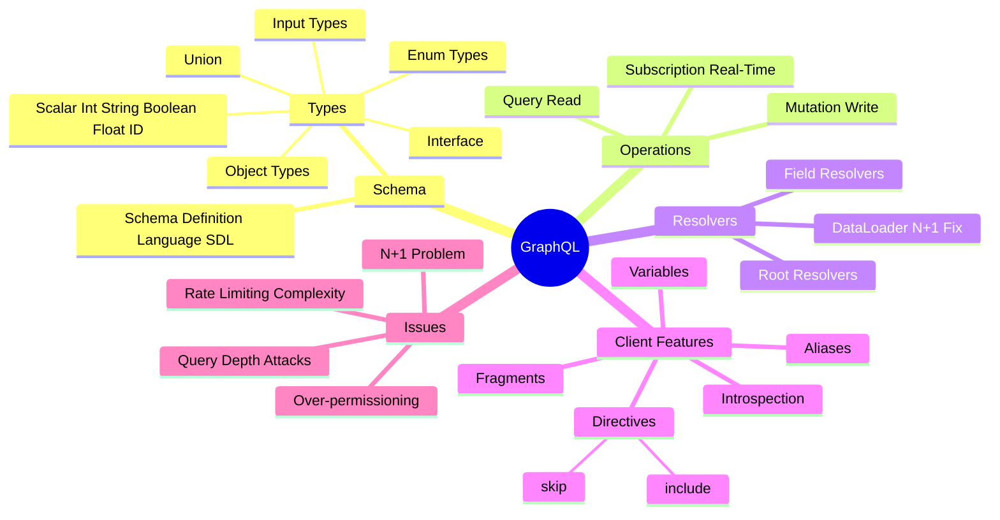

# GraphQL

> **GraphQL is a query language for your API** — the client specifies exactly what data it needs, and the server returns exactly that. One endpoint, flexible queries.

---

## REST vs GraphQL Side by Side

```
REST: Multiple trips, over-fetching
──────────────────────────────────
GET /users/42         → { id, name, email, phone, address, ... }  (too much!)
GET /users/42/posts   → [{ id, title, content, comments, ... }]   (too much!)

GraphQL: One trip, exactly what you need
─────────────────────────────────────────
POST /graphql
{
  user(id: 42) {
    name
    posts {
      title
    }
  }
}
→ { "user": { "name": "Madhu", "posts": [{ "title": "Hello" }] } }
```

---

## Core Concepts Mindmap



---

## Schema Definition Language (SDL)

```graphql
# Scalar types: Int, Float, String, Boolean, ID
# ! means non-null (required)

type User {
  id: ID!
  name: String!
  email: String!
  role: Role!
  posts: [Post!]!
  createdAt: String!
}

type Post {
  id: ID!
  title: String!
  content: String
  author: User!
  comments: [Comment!]!
}

type Comment {
  id: ID!
  text: String!
  author: User!
}

enum Role {
  ADMIN
  DEVELOPER
  VIEWER
}

# Input type for mutations
input CreateUserInput {
  name: String!
  email: String!
  role: Role!
}
```

---

## Queries

```graphql
# Simple query
query GetUser {
  user(id: "42") {
    name
    email
  }
}

# Query with variables
query GetUser($userId: ID!) {
  user(id: $userId) {
    name
    email
    posts {
      title
      comments {
        text
      }
    }
  }
}

# Variables passed separately:
{ "userId": "42" }

# Aliases — query same field with different args
query GetTwoUsers {
  firstUser: user(id: "1") {
    name
  }
  secondUser: user(id: "2") {
    name
  }
}
```

---

## Mutations

```graphql
# Create
mutation CreateUser($input: CreateUserInput!) {
  createUser(input: $input) {
    id
    name
    email
  }
}

# Variables:
{
  "input": {
    "name": "Madhu",
    "email": "madhu@example.com",
    "role": "DEVELOPER"
  }
}

# Update
mutation UpdateUser($id: ID!, $name: String!) {
  updateUser(id: $id, name: $name) {
    id
    name
  }
}

# Delete
mutation DeleteUser($id: ID!) {
  deleteUser(id: $id) {
    success
    message
  }
}
```

---

## Subscriptions (Real-Time)

```graphql
# Schema definition
type Subscription {
  messageAdded(channelId: ID!): Message!
}

# Client subscribes (uses WebSocket under the hood)
subscription OnNewMessage($channelId: ID!) {
  messageAdded(channelId: $channelId) {
    id
    text
    author {
      name
    }
  }
}
# Server pushes updates whenever a message is added
```

---

## Fragments — Reusable Field Sets

```graphql
fragment UserFields on User {
  id
  name
  email
}

query GetUsers {
  user(id: "42") {
    ...UserFields       # Spread the fragment
    posts {
      title
    }
  }
  anotherUser: user(id: "99") {
    ...UserFields
  }
}
```

---

## Directives

```graphql
query GetUser($withPosts: Boolean!, $skipEmail: Boolean!) {
  user(id: "42") {
    name
    email @skip(if: $skipEmail)         # Skip if true
    posts @include(if: $withPosts) {    # Include if true
      title
    }
  }
}
```

---

## The N+1 Problem

> The most common GraphQL performance pitfall. Critical to understand for interviews.

```
Query:
  users {           # 1 DB call → returns 100 users
    name
    posts {         # 100 DB calls (1 per user)!
      title
    }
  }

Total: 101 queries for what should be 2.
```

### The Fix: DataLoader (Batching)

```
Without DataLoader:
  user 1 → SELECT * FROM posts WHERE user_id = 1
  user 2 → SELECT * FROM posts WHERE user_id = 2
  ...    → 100 queries

With DataLoader (batches all IDs, one query):
  → SELECT * FROM posts WHERE user_id IN (1,2,...,100)
  → 1 query total ✅
```

```javascript
// DataLoader example
const postLoader = new DataLoader(async (userIds) => {
  const posts = await db.posts.findAll({ where: { userId: userIds } });
  // Group by userId so DataLoader can map them back
  return userIds.map(id => posts.filter(p => p.userId === id));
});

// In resolver:
posts: (user) => postLoader.load(user.id)  // batched automatically
```

---

## Introspection

> GraphQL APIs are self-documenting — you can query the schema itself.

```graphql
# Ask the API what types exist
{
  __schema {
    types {
      name
      kind
    }
  }
}

# Ask what fields a type has
{
  __type(name: "User") {
    fields {
      name
      type {
        name
        kind
      }
    }
  }
}
```

> Tools like **GraphiQL** and **Apollo Studio** use introspection to build interactive documentation automatically.

---

## Security Concerns

| Attack | Description | Fix |
|--------|-------------|-----|
| **Deep queries** | `user { friends { friends { friends { ... } } } }` | Max query depth limit |
| **Query complexity** | Huge result sets via nested lists | Complexity scoring |
| **Introspection abuse** | Mapping your schema to find vulnerabilities | Disable in production |
| **Batching attacks** | Many mutations in one request | Rate limit by operations |

---

## Error Handling

> GraphQL always returns `200 OK` — errors live inside the response body.

```json
{
  "data": {
    "user": null
  },
  "errors": [
    {
      "message": "User not found",
      "locations": [{ "line": 2, "column": 3 }],
      "path": ["user"],
      "extensions": {
        "code": "NOT_FOUND",
        "statusCode": 404
      }
    }
  ]
}
```

> This is a key difference from REST — **GraphQL always returns 200**, even for errors. You must check the `errors` array.

---

## GraphQL vs REST: When to Choose

```
Choose GraphQL when:
  ✅ Mobile clients need to minimize bandwidth (fetch only what's needed)
  ✅ Multiple clients need different data shapes (web, mobile, TV)
  ✅ Rapid iteration — frontend can query new fields without API changes
  ✅ Complex, deeply nested data (social graph, product catalog)

Choose REST when:
  ✅ Simple CRUD operations
  ✅ Public API (REST is more universally understood)
  ✅ File uploads (GraphQL handles these awkwardly)
  ✅ HTTP caching is important (REST GET responses cache naturally)
  ✅ Team unfamiliar with GraphQL
```

---

## Quick Reference Card

```
Operation Types:
  query     → Read (like GET)
  mutation  → Write (like POST/PUT/DELETE)
  subscription → Real-time (like WebSocket)

Key terms:
  Schema    → Contract between client and server
  Type      → Shape of data (User, Post, etc.)
  Resolver  → Function that fetches data for a field
  Fragment  → Reusable field set
  Variable  → Dynamic values in queries
  DataLoader → N+1 problem solver (batch + cache)
  Introspection → Self-documentation via __schema queries

Always returns HTTP 200 — check errors[] array!
```

---

> **Interview tips:**
> - The N+1 problem + DataLoader fix is almost always asked
> - Explain why GraphQL always returns 200 OK
> - Discuss over-fetching/under-fetching as motivation for GraphQL
> - Know when NOT to use GraphQL (file uploads, simple CRUD, caching)
