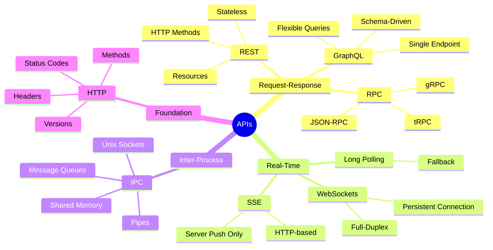

# API Fundamentals: Interview Prep Guide

A complete reference for API design concepts — REST, HTTP, GraphQL, RPC, IPC, WebSockets, SSE, and Status Codes. Built as a fast, visual refresher for interviews.

---

## What's Covered

| Topic | Key Concepts |
|-------|-------------|
| [HTTP](http.md) | Methods, Headers, Versions, CORS, Caching |
| [REST](rest.md) | Constraints, Resources, Verbs, Idempotency |
| [GraphQL](graphql.md) | Schema, Queries, Mutations, Subscriptions, N+1 |
| [RPC](rpc.md) | gRPC, JSON-RPC, tRPC, Protobuf |
| [IPC](ipc.md) | Pipes, Sockets, Shared Memory, Message Queues |
| [WebSockets](websockets.md) | Full-duplex, Handshake, Use Cases |
| [SSE](sse.md) | Server-Push, EventSource, vs WebSockets |
| [Status Codes](status-codes.md) | 1xx–5xx Reference, Common Codes |

---

## API Landscape Mindmap



---

## Quick Comparison: When to Use What?

```
┌─────────────────┬────────────────┬──────────────────────────────────────────────────┐
│ Protocol        │ Transport      │ Best For                                          │
├─────────────────┼────────────────┼──────────────────────────────────────────────────┤
│ REST            │ HTTP           │ CRUD APIs, public APIs, resource-based design     │
│ GraphQL         │ HTTP           │ Complex queries, mobile clients, aggregation      │
│ gRPC            │ HTTP/2         │ Microservices, low-latency, strongly-typed        │
│ WebSockets      │ TCP            │ Chat, live feeds, multiplayer games               │
│ SSE             │ HTTP           │ Notifications, dashboards, one-way server push    │
│ IPC             │ OS-level       │ Same-machine process communication                │
└─────────────────┴────────────────┴──────────────────────────────────────────────────┘
```

---

## The Request-Response Cycle (Big Picture)

```
Client                         Network                        Server
  │                               │                               │
  │──── DNS Lookup ──────────────▶│                               │
  │◀─── IP Address ───────────────│                               │
  │                               │                               │
  │──── TCP Handshake ───────────▶│──── TCP Handshake ───────────▶│
  │◀─── SYN-ACK ──────────────────│◀──── SYN-ACK ─────────────────│
  │                               │                               │
  │──── TLS Handshake (HTTPS) ───▶│──── TLS Handshake ───────────▶│
  │◀─── Certificate / Keys ───────│◀──── Keys ────────────────────│
  │                               │                               │
  │──── HTTP Request ────────────▶│──── HTTP Request ────────────▶│
  │◀─── HTTP Response ────────────│◀──── HTTP Response ────────────│
  │                               │                               │
```

---

> **Interview tip:** Be ready to explain trade-offs between REST vs GraphQL vs gRPC. Interviewers love that question. The answer always depends on the use case — there's no universal winner.
