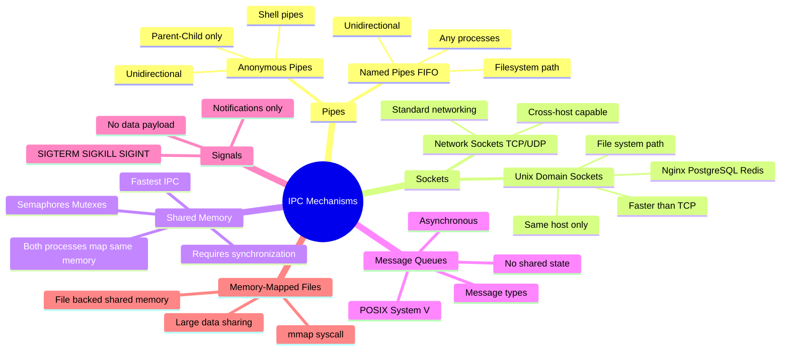

# IPC — Inter-Process Communication

> **IPC is how two processes on the same machine (or sometimes across machines) communicate.** Unlike network APIs, IPC mechanisms are OS-level primitives — faster, lower overhead, but limited to the same host (usually).

---

## Why IPC?

```
Process A and Process B need to share data or coordinate.
They can't share memory directly (OS enforces isolation).
IPC provides controlled channels between them.

Use cases:
  - Microservices on same host communicating via Unix sockets
  - Browser sending commands to a background worker
  - Database server and its client library
  - Shell pipes: cat file.txt | grep "error" | wc -l
  - Electron: renderer process ↔ main process
```

---

## IPC Mechanisms Overview



---

## Pipes

### Anonymous Pipes (Shell `|`)

```bash
# Classic Unix pipeline
cat /var/log/nginx/access.log | grep "ERROR" | awk '{print $1}' | sort | uniq -c

# Each | creates a pipe:
# cat → pipe1 → grep → pipe2 → awk → pipe3 → sort → pipe4 → uniq
```

```
Process A ──[write end]──▶ [kernel buffer] ──▶[read end]── Process B
                           (pipe)
- Unidirectional
- Parent creates pipe before fork(), child inherits file descriptors
- Anonymous: no name in filesystem
- Automatic cleanup when both ends close
```

### Named Pipes (FIFOs)

```bash
# Create a named pipe
mkfifo /tmp/my-pipe

# Process A writes to it
echo "Hello from A" > /tmp/my-pipe &

# Process B reads from it
cat /tmp/my-pipe
# Output: Hello from A

# Cleanup
rm /tmp/my-pipe
```

```
- Appears as a file in the filesystem
- Any two processes can use it (not just parent-child)
- Still unidirectional
- Blocks on open() until both ends are open
```

---

## Unix Domain Sockets

> The preferred IPC for high-performance same-host communication. Looks like a network socket but never leaves the kernel — much faster than TCP.

```python
# Server (Python)
import socket, os

SOCKET_PATH = "/tmp/my-app.sock"
if os.path.exists(SOCKET_PATH):
    os.remove(SOCKET_PATH)

server = socket.socket(socket.AF_UNIX, socket.SOCK_STREAM)
server.bind(SOCKET_PATH)
server.listen(1)

conn, _ = server.accept()
data = conn.recv(1024)
conn.send(b"Hello from server!")
conn.close()

# Client
client = socket.socket(socket.AF_UNIX, socket.SOCK_STREAM)
client.connect("/tmp/my-app.sock")
client.send(b"Hello!")
response = client.recv(1024)
```

### Who Uses Unix Sockets?

| Software | Socket Path |
|----------|-------------|
| Nginx → PHP-FPM | `/var/run/php/php8.1-fpm.sock` |
| PostgreSQL | `/var/run/postgresql/.s.PGSQL.5432` |
| Redis (local) | `/var/run/redis/redis.sock` |
| Docker daemon | `/var/run/docker.sock` |
| MySQL | `/var/run/mysqld/mysqld.sock` |

```
Unix Socket vs TCP localhost:
  TCP localhost: goes through full network stack (loopback)
  Unix socket:   stays in kernel, no TCP overhead
  Speed: Unix socket is ~30-50% faster for same-host IPC
```

---

## Shared Memory

> The **fastest** IPC — both processes map the same physical memory pages. No copying, just read/write.

```c
// Process A: Create and write
int shm_fd = shm_open("/my-shm", O_CREAT | O_RDWR, 0666);
ftruncate(shm_fd, 1024);                          // Set size
void* ptr = mmap(0, 1024, PROT_WRITE, MAP_SHARED, shm_fd, 0);
sprintf(ptr, "Hello from Process A!");

// Process B: Open and read
int shm_fd = shm_open("/my-shm", O_RDONLY, 0666);
void* ptr = mmap(0, 1024, PROT_READ, MAP_SHARED, shm_fd, 0);
printf("%s\n", (char*)ptr);  // "Hello from Process A!"

// Cleanup (Process A)
munmap(ptr, 1024);
shm_unlink("/my-shm");
```

### The Synchronization Problem

```
Process A writes: "HELLO"
Process B reads:  "HEL??" ← race condition!

Both read and write simultaneously without locking = data corruption.

Solution: Semaphores or Mutexes
  sem_wait(sem);    // Lock
  // write/read shared memory
  sem_post(sem);    // Unlock
```

---

## Message Queues

> Processes exchange discrete messages — sender doesn't wait for receiver (async). Messages persist in the kernel queue.

```c
// POSIX Message Queue
// Send
mqd_t mq = mq_open("/my-queue", O_CREAT | O_WRONLY, 0644, &attr);
mq_send(mq, "job:process-image:42", 20, 1);  // message, size, priority

// Receive
mqd_t mq = mq_open("/my-queue", O_RDONLY, 0644, NULL);
mq_receive(mq, buffer, sizeof(buffer), &priority);
```

```
Key properties:
  ✅ Asynchronous — sender doesn't block waiting for receiver
  ✅ Messages are discrete units (not a stream)
  ✅ Priority ordering supported
  ✅ Messages persist if receiver is slow
  ❌ Size limits per message
  ❌ Total queue size limit (kernel managed)
```

---

## Signals

> Asynchronous notifications to a process. **No data payload** — just a signal number.

```bash
# Common signals
kill -SIGTERM 1234    # Graceful shutdown (can be caught)
kill -SIGKILL 1234    # Force kill (cannot be caught!)
kill -SIGHUP 1234     # Reload config (nginx uses this)
kill -SIGUSR1 1234    # User-defined signal 1
```

```c
// Handle a signal in C
#include <signal.h>

void handle_sigterm(int sig) {
    printf("Received SIGTERM, shutting down gracefully...\n");
    cleanup();
    exit(0);
}

signal(SIGTERM, handle_sigterm);  // Register handler
```

### Common Signals Reference

| Signal | Number | Default | Catchable | Use |
|--------|--------|---------|-----------|-----|
| `SIGTERM` | 15 | Terminate | ✅ | Graceful shutdown |
| `SIGKILL` | 9 | Terminate | ❌ | Force kill |
| `SIGINT` | 2 | Terminate | ✅ | Ctrl+C |
| `SIGHUP` | 1 | Terminate | ✅ | Reload config |
| `SIGCHLD` | 17 | Ignore | ✅ | Child process exited |
| `SIGUSR1/2` | 10/12 | Terminate | ✅ | App-specific |

---

## IPC Comparison

```
┌─────────────────┬───────────┬─────────┬──────────┬────────────┬──────────────────────────┐
│ Mechanism       │ Speed     │ Async   │ Persist  │ Direction  │ Best For                 │
├─────────────────┼───────────┼─────────┼──────────┼────────────┼──────────────────────────┤
│ Pipes           │ Fast      │ No      │ No       │ One-way    │ Shell commands, parent-  │
│                 │           │         │          │            │ child communication      │
│ Named Pipes     │ Fast      │ No      │ No       │ One-way    │ Unrelated processes      │
│ Unix Sockets    │ Very fast │ Yes     │ No       │ Both ways  │ Local services (nginx,   │
│                 │           │         │          │            │ postgres, docker)        │
│ Shared Memory   │ Fastest   │ No      │ No       │ Both ways  │ Large data, high-freq   │
│                 │           │         │          │            │ reads (with sync)        │
│ Message Queues  │ Fast      │ Yes     │ Yes      │ Both ways  │ Task queues, decoupling  │
│ Signals         │ Instant   │ Yes     │ No       │ One-way    │ Notifications, control   │
└─────────────────┴───────────┴─────────┴──────────┴────────────┴──────────────────────────┘
```

---

## Real-World Patterns

### Web Server + App Server (Unix Socket)

```
Browser
  │
  ▼ TCP (port 80/443)
Nginx
  │
  ▼ Unix Socket (/run/app.sock)   ← faster than TCP localhost
Node.js / PHP-FPM / Gunicorn
  │
  ▼ DB connection pool
PostgreSQL (Unix socket locally)
```

### Worker Process Pattern (Message Queue)

```
API Server                    Worker Pool
    │                              │
    │── POST /jobs ──▶ kernel ──▶  │
    │   (enqueue msg to queue)     │ dequeue → process → ack
    │                              │
    │◀──── async result (webhook or polling)
```

---

> **Interview tips:**
> - Unix sockets > TCP for same-host communication — explain why (no TCP stack overhead)
> - Shared memory is fastest but needs explicit synchronization (race conditions!)
> - Signals can't carry data — they're just event notifications
> - Pipes are unidirectional — for bidirectional, use two pipes or a socket
