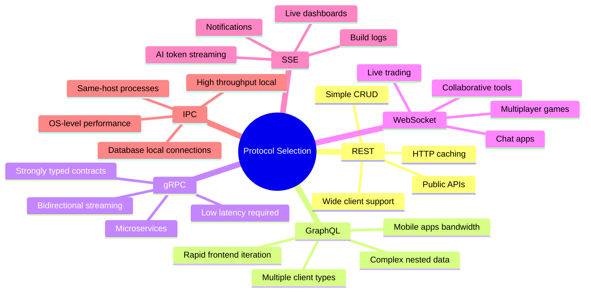

# API Design Patterns & Interview Cheat Sheet

> Fast-access reference for common API design patterns, best practices, and interview talking points.

---

## Authentication & Authorization Patterns

```
┌──────────────────┬───────────────────────────────────────────────────────────┐
│ Method           │ How it works                                              │
├──────────────────┼───────────────────────────────────────────────────────────┤
│ API Key          │ Static secret in header: X-API-Key: abc123               │
│                  │ Simple but can't expire, hard to rotate                   │
├──────────────────┼───────────────────────────────────────────────────────────┤
│ Basic Auth       │ Base64(username:password) in Authorization header        │
│                  │ Insecure without HTTPS, sent every request               │
├──────────────────┼───────────────────────────────────────────────────────────┤
│ Bearer Token     │ Authorization: Bearer <token>                            │
│                  │ Usually a JWT or opaque token from OAuth                 │
├──────────────────┼───────────────────────────────────────────────────────────┤
│ JWT              │ Self-contained: header.payload.signature                 │
│                  │ Stateless — server verifies signature, no DB lookup      │
├──────────────────┼───────────────────────────────────────────────────────────┤
│ OAuth 2.0        │ Delegated access — user grants app access to their data  │
│                  │ Authorization Code, Client Credentials, Device flows      │
├──────────────────┼───────────────────────────────────────────────────────────┤
│ mTLS             │ Both client and server present certificates               │
│                  │ Strongest — used in microservice-to-microservice          │
└──────────────────┴───────────────────────────────────────────────────────────┘
```

### JWT Structure

```
eyJhbGciOiJIUzI1NiIsInR5cCI6IkpXVCJ9   ← Header (base64)
.eyJzdWIiOiI0MiIsInJvbGUiOiJhZG1pbiIsImV4cCI6MTcwNDA2NzIwMH0  ← Payload
.SflKxwRJSMeKKF2QT4fwpMeJf36POk6yJV_adQssw5c   ← Signature

Decoded payload:
{
  "sub": "42",          // subject (user ID)
  "role": "admin",
  "exp": 1704067200,    // expiry (Unix timestamp)
  "iat": 1704063600     // issued at
}
```

> JWT is **not encrypted** by default — payload is base64, anyone can read it. Use JWE for encryption. Never store secrets in JWT payload.

---

## Rate Limiting Algorithms

```
Token Bucket (most common):
  - Bucket fills with N tokens per second
  - Each request consumes 1 token
  - Allows bursting up to bucket capacity

Sliding Window:
  - Count requests in the last N seconds
  - More accurate than fixed window
  - Prevents boundary bursts

Fixed Window:
  - Count resets every N seconds
  - Simple but allows 2x burst at window boundary
  - Window resets: 10:00, 10:01, 10:02...

Leaky Bucket:
  - Requests enter queue, process at fixed rate
  - Smooths out traffic, no bursting allowed
```

---

## API Versioning Comparison

```
Strategy         Example                          Pros          Cons
──────────────── ──────────────────────────────── ───────────── ─────────────────
URL Path         /v1/users, /v2/users             Simple        URL pollution
Query Param      /users?version=2                 Optional      Easy to miss
Accept Header    Accept: application/vnd.v2+json  Clean URLs    Less discoverable
Subdomain        v2.api.example.com               Full isolate  DNS overhead
Custom Header    X-API-Version: 2                 Flexible      Non-standard
```

---

## Common API Design Patterns

### Batch Operations

```json
POST /batch
{
  "operations": [
    { "method": "GET", "path": "/users/1" },
    { "method": "DELETE", "path": "/users/2" },
    { "method": "POST", "path": "/users", "body": {"name": "New"} }
  ]
}

Response:
{
  "results": [
    { "status": 200, "body": { "id": 1, "name": "Alice" } },
    { "status": 204 },
    { "status": 201, "body": { "id": 99, "name": "New" } }
  ]
}
```

### Async / Long-Running Operations

```
POST /reports/generate
→ 202 Accepted
  { "jobId": "job-abc", "statusUrl": "/jobs/job-abc" }

GET /jobs/job-abc
→ 200 OK  { "status": "processing", "progress": 45 }

GET /jobs/job-abc  (later)
→ 200 OK  { "status": "complete", "resultUrl": "/reports/42" }

GET /reports/42
→ 200 OK  { "data": [...] }
```

### Idempotency Keys (Safe Retries)

```
POST /payments
Idempotency-Key: client-generated-uuid-here

→ 201 Created  { "id": "pay_abc" }

# Client retries (network timeout):
POST /payments
Idempotency-Key: client-generated-uuid-here  ← same key

→ 200 OK  { "id": "pay_abc" }  ← returns original, no duplicate charge!
```

---

## Error Response Design

```json
// Consistent error format (don't just return a string!)
{
  "error": {
    "code": "VALIDATION_ERROR",
    "message": "Request validation failed",
    "details": [
      {
        "field": "email",
        "message": "Must be a valid email address",
        "value": "notanemail"
      },
      {
        "field": "age",
        "message": "Must be >= 0",
        "value": -1
      }
    ],
    "requestId": "req-abc-123",
    "timestamp": "2025-01-01T00:00:00Z",
    "docs": "https://api.example.com/errors/VALIDATION_ERROR"
  }
}
```

---

## Real-Time Patterns: Decision Tree

```
Need real-time updates?
  No  → Standard REST/GraphQL
  Yes ↓

Client sends AND receives in real-time?
  Yes → WebSocket
  No  ↓

Server pushes only?
  Yes ↓

Is client a browser?
  Yes → SSE (simple) or WebSocket (if need binary)
  No  → WebSocket or gRPC streaming

Need reliability / message history?
  Yes → Message Queue (Kafka, RabbitMQ, SQS) + polling
  No  → SSE or WebSocket
```

---

## API Security Checklist

```
Authentication & Authorization:
  ☐ All endpoints require auth (except public ones)
  ☐ Use HTTPS everywhere (TLS 1.2+)
  ☐ JWT: verify signature, check exp, validate claims
  ☐ Principle of least privilege on tokens/scopes
  ☐ Rotate API keys on compromise

Input Validation:
  ☐ Validate all inputs at API boundary
  ☐ Parameterized queries (no SQL injection)
  ☐ Sanitize for XSS in any HTML contexts
  ☐ Limit request body size
  ☐ Validate Content-Type

Rate Limiting & Protection:
  ☐ Rate limit by IP and by user
  ☐ Return 429 with Retry-After header
  ☐ Protect auth endpoints more aggressively

Headers:
  ☐ CORS: restrict to allowed origins
  ☐ X-Content-Type-Options: nosniff
  ☐ X-Frame-Options: DENY
  ☐ Strict-Transport-Security (HSTS)
  ☐ Don't expose server/framework version

Sensitive Data:
  ☐ Never log auth tokens or passwords
  ☐ Mask/truncate sensitive fields in logs
  ☐ Don't return sensitive data in errors
  ☐ Use 404 (not 403) to hide existence of private resources
```

---

## Interview Questions & Talking Points

### "Design an API for X"
1. Identify resources (nouns)
2. Define CRUD operations + HTTP methods
3. Design URL structure (hierarchical, plural nouns)
4. Pick status codes for each outcome
5. Define error response format
6. Consider pagination, filtering, sorting
7. Think about versioning strategy
8. Add auth (what level of access for what?)

### "REST vs GraphQL vs gRPC"
```
REST:    Resource-oriented, widely understood, HTTP caching works
GraphQL: Flexible queries, solves over/under-fetching, typed schema
gRPC:    Fast binary, streaming, strongly typed, ideal for microservices

Key question: Who are the clients? Public → REST. Mobile bandwidth-sensitive → GraphQL. Internal services → gRPC.
```

### "How would you handle API versioning?"
```
For public APIs: URL path versioning (/v1/, /v2/) — most discoverable
For internal: Header-based versioning — cleaner URLs
Always: maintain old versions for deprecation window (6-12 months)
Communicate breaking changes via changelog, email, deprecation headers
```

### "How do you handle long-running operations?"
```
Return 202 Accepted immediately
Include a job ID and status polling URL
Support webhooks for push notification on completion
Consider: SSE or WebSocket for progress streaming
```

---

## Quick Compare: All Protocols


