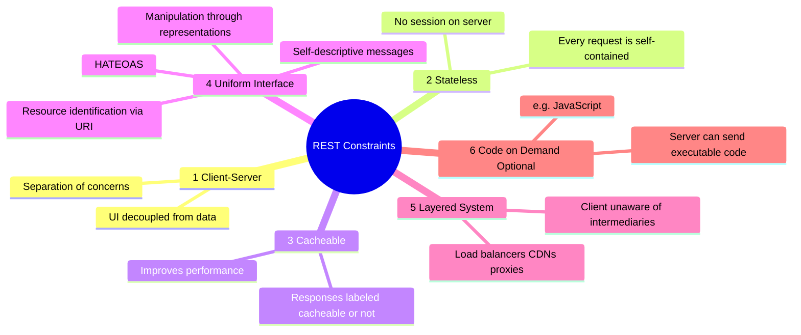

# REST — Representational State Transfer

> **REST is an architectural style**, not a protocol. It defines constraints that, when followed, produce scalable, maintainable APIs.

---

## The 6 REST Constraints



### Constraint Quick Summary

| Constraint | One-liner |
|-----------|-----------|
| **Client-Server** | Frontend and backend are independent |
| **Stateless** | Server holds no client session — auth token sent every request |
| **Cacheable** | Responses must declare if they can be cached |
| **Uniform Interface** | Consistent, predictable API surface |
| **Layered System** | Client doesn't know if it's talking to a proxy, CDN, or origin |
| **Code on Demand** | Server can send JS to execute (optional, rarely used) |

---

## Resources & URIs

> **In REST, everything is a resource.** Resources are nouns, not verbs.

### Good vs Bad URI Design

```
✅ GOOD — Noun-based, hierarchical
GET    /users              → List all users
GET    /users/42           → Get user 42
POST   /users              → Create a user
PUT    /users/42           → Replace user 42
PATCH  /users/42           → Update user 42 partially
DELETE /users/42           → Delete user 42
GET    /users/42/orders    → Get orders for user 42
GET    /users/42/orders/7  → Get order 7 for user 42

❌ BAD — Verb-based, non-REST
GET    /getUsers
POST   /createUser
GET    /deleteUser?id=42
POST   /users/42/doSomething
```

### URI Design Rules

| Rule | Example |
|------|---------|
| Use nouns not verbs | `/users` not `/getUsers` |
| Use plural nouns | `/users` not `/user` |
| Use lowercase + hyphens | `/user-profiles` not `/userProfiles` |
| Nest for relationships | `/users/42/orders` |
| No trailing slash | `/users/42` not `/users/42/` |
| Version in URL or header | `/v1/users` or `Accept: application/vnd.api+json;version=1` |

---

## HTTP Methods in REST

```
┌────────────┬────────────────────┬──────────┬─────────────┬────────────────────────┐
│ Method     │ Action             │ Safe     │ Idempotent  │ Example                │
├────────────┼────────────────────┼──────────┼─────────────┼────────────────────────┤
│ GET        │ Read               │ ✅       │ ✅          │ GET /users/42          │
│ POST       │ Create             │ ❌       │ ❌          │ POST /users            │
│ PUT        │ Replace (full)     │ ❌       │ ✅          │ PUT /users/42          │
│ PATCH      │ Update (partial)   │ ❌       │ ❌ (usually)│ PATCH /users/42        │
│ DELETE     │ Delete             │ ❌       │ ✅          │ DELETE /users/42       │
└────────────┴────────────────────┴──────────┴─────────────┴────────────────────────┘
```

### Idempotency Deep Dive

```
Idempotent: f(f(x)) = f(x) — applying it multiple times = applying it once

DELETE /users/42  →  1st call: 200 OK (deleted)
DELETE /users/42  →  2nd call: 404 Not Found
Both have same EFFECT on server state (user 42 is gone)  ✅ Idempotent

POST /users  →  1st call: creates user, returns id=42
POST /users  →  2nd call: creates ANOTHER user, returns id=43
Different effect each time  ❌ NOT Idempotent
```

---

## REST Request/Response Example

```json
// POST /api/v1/users
// Request
{
  "name": "Madhu",
  "email": "madhu@example.com",
  "role": "developer"
}

// Response: 201 Created
// Location: /api/v1/users/42
{
  "id": 42,
  "name": "Madhu",
  "email": "madhu@example.com",
  "role": "developer",
  "createdAt": "2025-01-01T00:00:00Z",
  "_links": {
    "self": { "href": "/api/v1/users/42" },
    "orders": { "href": "/api/v1/users/42/orders" }
  }
}
```

> The `_links` section is **HATEOAS** — Hypermedia As The Engine Of Application State. The client discovers next actions from the response itself.

---

## HATEOAS

```
Without HATEOAS:
  Client has to KNOW the URL structure upfront
  Tight coupling between client and server routing

With HATEOAS:
  Server tells client what it can do next via links in response
  Client just follows links — loosely coupled
```

Example response with HATEOAS:
```json
{
  "id": 42,
  "status": "pending",
  "_links": {
    "self":    { "href": "/orders/42" },
    "cancel":  { "href": "/orders/42/cancel",  "method": "POST" },
    "pay":     { "href": "/orders/42/payment", "method": "POST" }
  }
}
```

> Rarely fully implemented in practice, but good to know for interviews.

---

## Versioning Strategies

| Strategy | Example | Pros | Cons |
|----------|---------|------|------|
| **URL path** | `/v1/users` | Simple, visible | URL pollution |
| **Query param** | `/users?version=1` | Optional | Easy to miss |
| **Header** | `Accept: application/vnd.api+json;v=1` | Clean URLs | Less discoverable |
| **Subdomain** | `v1.api.example.com` | Full isolation | DNS overhead |

> Most APIs use **URL path** versioning — it's the most obvious to API consumers.

---

## Pagination Patterns

### Offset-based (Simple but fragile)
```
GET /users?limit=10&offset=20
→ Page 3 of results

Problem: If records are inserted/deleted mid-pagination, results shift
```

### Cursor-based (Better for real-time data)
```
GET /users?limit=10&after=eyJpZCI6MjB9  (opaque cursor)
→ Stable — cursor points to a specific record, not an offset

Response includes:
{
  "data": [...],
  "cursor": {
    "next": "eyJpZCI6MzB9",
    "hasMore": true
  }
}
```

### Page-based
```
GET /users?page=3&per_page=10
→ Simple, maps to UI pagination naturally
```

---

## REST Maturity Model (Richardson)

```
Level 0 — The Swamp of POX
  POST /api  (all requests to one endpoint, body determines action)

Level 1 — Resources
  POST /users/create
  POST /users/42/delete
  (correct URIs, but wrong methods)

Level 2 — HTTP Verbs ← Most APIs stop here
  GET  /users
  POST /users
  DELETE /users/42

Level 3 — Hypermedia (HATEOAS)
  GET /users/42
  → response includes links to related actions
```

---

## REST vs Alternatives

| | REST | GraphQL | gRPC |
|-|------|---------|------|
| **Protocol** | HTTP | HTTP | HTTP/2 |
| **Format** | JSON/XML | JSON | Protobuf |
| **Schema** | None (OpenAPI optional) | Typed schema | Typed `.proto` |
| **Flexibility** | Fixed endpoints | Flexible queries | Fixed RPC methods |
| **Over/Under-fetching** | Common issue | Solved | Solved |
| **Browser support** | Native | Native | Limited |
| **Best for** | Public APIs, simple CRUD | Complex data, mobile | Microservices |

---

## Common REST Mistakes

```
❌ Using GET for destructive actions
   GET /users/42/delete  →  Cacheable by browsers/CDNs — dangerous!

❌ Verbs in URIs
   POST /createOrder  →  Use  POST /orders

❌ Returning 200 for errors
   200 OK  { "success": false, "error": "Not found" }

❌ Not using status codes correctly
   Always returning 400 for everything bad

❌ Inconsistent naming
   /userOrders vs /user-orders vs /UserOrders in same API
```

---

> **Interview tips:**
> - Explain idempotency clearly with DELETE example
> - Know all 6 REST constraints — Level 2 vs Level 3 (HATEOAS) is a good discussion point
> - Be able to critique "REST" APIs that aren't truly RESTful
> - Cursor vs offset pagination trade-offs come up often
