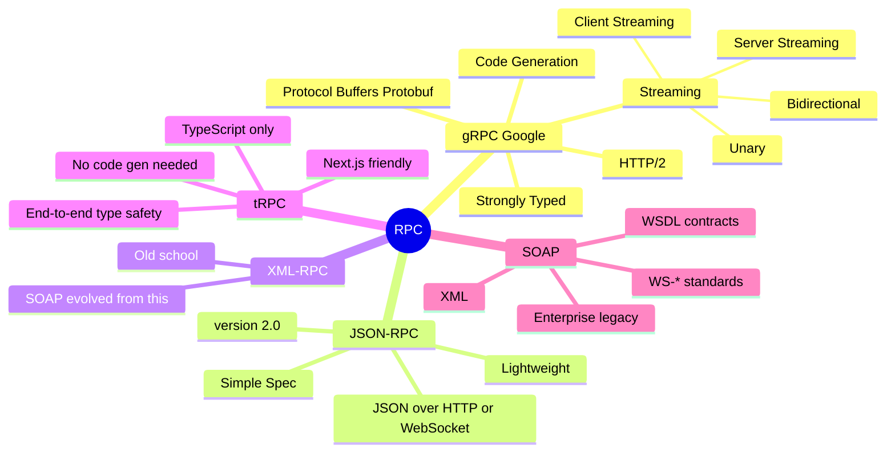

# RPC — Remote Procedure Call

> **RPC makes calling a function on another machine feel like calling a local function.** You define procedures (functions), and the framework handles serialization, transport, and deserialization.

---

## The Core Idea

```
REST thinks in Resources:        RPC thinks in Actions:
───────────────────────          ───────────────────────
POST /emails                     sendEmail(to, subject, body)
GET  /users/42                   getUser(id: 42)
DELETE /sessions/abc             logout(sessionId: "abc")
PATCH /orders/7                  updateOrderStatus(id: 7, status: "shipped")
```

> REST = nouns (resources). RPC = verbs (actions).

---

## RPC Landscape Mindmap



---

## gRPC

> Google's RPC framework. Uses Protocol Buffers for serialization and HTTP/2 for transport. The standard for microservice-to-microservice communication.

### Protocol Buffers (Protobuf)

```protobuf
// user.proto
syntax = "proto3";

package user;

service UserService {
  rpc GetUser(GetUserRequest) returns (UserResponse);
  rpc CreateUser(CreateUserRequest) returns (UserResponse);
  rpc ListUsers(ListUsersRequest) returns (stream UserResponse);  // Server streaming
  rpc UpdateUsers(stream UpdateUserRequest) returns (UpdateSummary);  // Client streaming
  rpc SyncUsers(stream UpdateUserRequest) returns (stream UserResponse);  // Bidirectional
}

message GetUserRequest {
  string id = 1;
}

message CreateUserRequest {
  string name = 1;
  string email = 2;
  Role role = 3;
}

message UserResponse {
  string id = 1;
  string name = 2;
  string email = 3;
  Role role = 4;
  int64 created_at = 5;
}

message ListUsersRequest {
  int32 page_size = 1;
  string page_token = 2;
}

enum Role {
  ROLE_UNSPECIFIED = 0;
  DEVELOPER = 1;
  ADMIN = 2;
}
```

The `.proto` file is compiled to generate client and server code in any supported language (Go, Python, Java, Node.js, etc.).

### gRPC Streaming Types

```
Unary (standard request-response):
  Client ──→ Request ──→ Server
  Client ←── Response ←── Server

Server Streaming (server sends multiple responses):
  Client ──→ Request ──→ Server
  Client ←── Response 1 ←── Server
  Client ←── Response 2 ←── Server
  Client ←── Response 3 ←── Server  (e.g., log streaming)

Client Streaming (client sends multiple requests):
  Client ──→ Upload 1 ──→ Server
  Client ──→ Upload 2 ──→ Server
  Client ──→ Upload 3 ──→ Server
  Client ←── Summary ←── Server  (e.g., file upload)

Bidirectional Streaming:
  Client ←──→ Both send messages simultaneously ←──→ Server
  (e.g., real-time chat, collaborative editing)
```

### Why gRPC?

| Feature | gRPC | REST+JSON |
|---------|------|-----------|
| **Serialization** | Protobuf (binary, ~5-10x smaller) | JSON (text, larger) |
| **Transport** | HTTP/2 (multiplexed) | HTTP/1.1 or HTTP/2 |
| **Schema** | Strongly typed `.proto` | Optional (OpenAPI) |
| **Code generation** | Auto-generated clients | Manual or OpenAPI codegen |
| **Streaming** | Native (4 types) | Workarounds (SSE, WS) |
| **Browser support** | Limited (needs gRPC-Web proxy) | Full native |
| **Latency** | Lower | Higher |

---

## gRPC vs REST Decision Flow

```
Need browser clients directly?
  Yes → REST or GraphQL
  No  ↓

Need real-time streaming?
  Yes → gRPC (streaming) or WebSocket
  No  ↓

Need strong typing between services?
  Yes → gRPC
  No  ↓

Simple CRUD for public API?
  Yes → REST
  No  → gRPC
```

---

## JSON-RPC 2.0

> Simple, lightweight RPC over HTTP or WebSocket. Request/response are plain JSON objects.

```json
// Request
{
  "jsonrpc": "2.0",
  "method": "getUser",
  "params": { "id": 42 },
  "id": 1
}

// Response (success)
{
  "jsonrpc": "2.0",
  "result": { "id": 42, "name": "Madhu" },
  "id": 1
}

// Response (error)
{
  "jsonrpc": "2.0",
  "error": {
    "code": -32602,
    "message": "Invalid params",
    "data": "id must be a number"
  },
  "id": 1
}

// Notification (no id = no response expected)
{
  "jsonrpc": "2.0",
  "method": "logEvent",
  "params": { "event": "user_login" }
}
```

### JSON-RPC Standard Error Codes

| Code | Meaning |
|------|---------|
| `-32700` | Parse error |
| `-32600` | Invalid Request |
| `-32601` | Method not found |
| `-32602` | Invalid params |
| `-32603` | Internal error |
| `-32000` to `-32099` | Server-defined errors |

---

## tRPC

> TypeScript-native RPC. No code generation, no schema files — type safety flows directly from server to client through TypeScript.

```typescript
// Server: Define procedures
import { initTRPC } from '@trpc/server';

const t = initTRPC.create();

export const appRouter = t.router({
  getUser: t.procedure
    .input(z.object({ id: z.string() }))
    .query(async ({ input }) => {
      return db.users.findById(input.id);
      // Return type is AUTOMATICALLY inferred by TypeScript
    }),

  createUser: t.procedure
    .input(z.object({ name: z.string(), email: z.string().email() }))
    .mutation(async ({ input }) => {
      return db.users.create(input);
    }),
});

export type AppRouter = typeof appRouter;

// Client: Fully typed, IntelliSense works!
const user = await trpc.getUser.query({ id: "42" });
//    ^ Type is automatically inferred from server return type
```

> **tRPC key insight:** The TypeScript type flows from server to client at build time — no HTTP call to discover the schema, no code generation step, no drift between client and server types.

---

## SOAP (Legacy but important to know)

> XML-based RPC standard, dominant in enterprise before REST took over.

```xml
<!-- SOAP Request -->
<soap:Envelope xmlns:soap="http://schemas.xmlsoap.org/soap/envelope/">
  <soap:Body>
    <GetUser xmlns="http://example.com/user">
      <UserId>42</UserId>
    </GetUser>
  </soap:Body>
</soap:Envelope>

<!-- SOAP Response -->
<soap:Envelope xmlns:soap="http://schemas.xmlsoap.org/soap/envelope/">
  <soap:Body>
    <GetUserResponse xmlns="http://example.com/user">
      <User>
        <Id>42</Id>
        <Name>Madhu</Name>
      </User>
    </GetUserResponse>
  </soap:Body>
</soap:Envelope>
```

| | SOAP | REST |
|-|------|------|
| Format | XML only | JSON, XML, anything |
| Contract | WSDL (strict) | OpenAPI (optional) |
| Transport | HTTP, SMTP, others | HTTP |
| Built-in standards | WS-Security, WS-Atomic | None |
| Verbosity | Very verbose | Concise |

---

## RPC vs REST vs GraphQL Summary

```
┌─────────────┬──────────────┬──────────────┬──────────────┐
│             │ REST         │ GraphQL      │ gRPC         │
├─────────────┼──────────────┼──────────────┼──────────────┤
│ Paradigm    │ Resources    │ Graph/Query  │ Procedures   │
│ Transport   │ HTTP/1.1+    │ HTTP         │ HTTP/2       │
│ Format      │ JSON         │ JSON         │ Protobuf     │
│ Schema      │ Optional     │ Required     │ Required     │
│ Browser     │ Native       │ Native       │ Proxy needed │
│ Streaming   │ SSE/WS workaround│ Subscriptions│ Native   │
│ Best for    │ Public APIs  │ Complex data │ Microservices│
└─────────────┴──────────────┴──────────────┴──────────────┘
```

---

> **Interview tips:**
> - gRPC is the go-to answer for microservice communication — explain Protobuf binary efficiency
> - Know the 4 streaming patterns in gRPC (unary, server, client, bidirectional)
> - tRPC is great if asked about type-safe APIs in TypeScript/Next.js context
> - REST vs RPC mental model: resources vs actions
