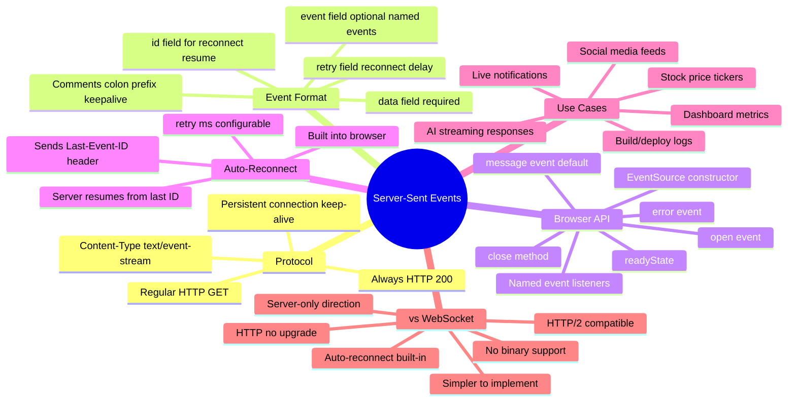

# SSE — Server-Sent Events

> **SSE is a one-way, server-to-client push mechanism over a regular HTTP connection.** The server streams events to the browser indefinitely. Simpler than WebSockets when you only need server → client updates.

---

## SSE vs WebSocket — The Core Difference

```
WebSocket:
  Client ←──────────────────▶ Server
         (full-duplex, both send)

SSE:
  Client ◀──────────────────── Server
         (server pushes only)
```

> If your client doesn't need to send data to the server in real time (only the server pushes), SSE is simpler and uses plain HTTP — no upgrade handshake, automatic reconnect built in.

---

## How SSE Works

```
Client sends a regular HTTP GET:
────────────────────────────────
GET /events HTTP/1.1
Accept: text/event-stream
Cache-Control: no-cache

Server responds with:
────────────────────────────────
HTTP/1.1 200 OK
Content-Type: text/event-stream
Cache-Control: no-cache
Connection: keep-alive

data: {"type":"notification","text":"Hello!"}

data: {"type":"notification","text":"Price updated"}

event: user-login
data: {"userId":"42","name":"Madhu"}

id: 100
data: {"type":"message","text":"Hey"}

: this is a comment, ignored by browser

retry: 3000

```

> The connection stays open forever. Server sends events as they happen. Each event ends with `\n\n` (two newlines).

---

## SSE Event Format

```
# Basic event (just data)
data: Hello World\n\n

# Multi-line data
data: line 1\n
data: line 2\n
data: line 3\n\n

# Named event (triggers specific event listener)
event: price-update\n
data: {"symbol":"AAPL","price":182.50}\n\n

# Event with ID (for reconnect resume)
id: 42\n
data: {"message":"Checkpoint 42"}\n\n

# Custom retry interval (milliseconds)
retry: 5000\n\n

# Comment (keepalive, ignored by browser)
: keepalive\n\n
```

---

## Browser EventSource API

```javascript
// Connect to SSE endpoint
const source = new EventSource('/api/events');
// With credentials (cookies)
const source = new EventSource('/api/events', { withCredentials: true });

// Default message event (no "event:" field)
source.addEventListener('message', (event) => {
  const data = JSON.parse(event.data);
  console.log('Message:', data);
  console.log('ID:', event.lastEventId);
});

// Named event listener
source.addEventListener('price-update', (event) => {
  const { symbol, price } = JSON.parse(event.data);
  updatePriceDisplay(symbol, price);
});

source.addEventListener('user-login', (event) => {
  const { userId } = JSON.parse(event.data);
  console.log(`User ${userId} logged in`);
});

// Connection opened
source.addEventListener('open', () => {
  console.log('SSE connected');
});

// Error + auto-reconnect
source.addEventListener('error', (event) => {
  if (source.readyState === EventSource.CLOSED) {
    console.log('Connection closed permanently');
  } else {
    // Browser will auto-reconnect (this is built in!)
    console.log('Connection error, will retry...');
  }
});

// Close connection
source.close();
```

---

## Automatic Reconnection (SSE's Killer Feature)

```
SSE reconnects automatically — no code needed.

Flow:
  1. Connection drops
  2. Browser waits retry ms (default 3000ms)
  3. Browser sends: Last-Event-ID: 42  (last seen event ID)
  4. Server resumes from where it left off

Server-side: honor Last-Event-ID header
────────────────────────────────────────
GET /events
Last-Event-ID: 42

Server: "OK, sending events from ID > 42"

# In Node.js:
app.get('/events', (req, res) => {
  const lastId = parseInt(req.headers['last-event-id']) || 0;
  // Send only events after lastId
});
```

---

## Server Implementation Examples

### Node.js (Express)

```javascript
app.get('/events', (req, res) => {
  res.setHeader('Content-Type', 'text/event-stream');
  res.setHeader('Cache-Control', 'no-cache');
  res.setHeader('Connection', 'keep-alive');
  res.setHeader('X-Accel-Buffering', 'no');  // Disable Nginx buffering

  // Send initial event
  res.write('data: {"type":"connected"}\n\n');

  // Send events every 5 seconds
  const interval = setInterval(() => {
    const event = {
      id: Date.now(),
      data: { timestamp: new Date().toISOString(), value: Math.random() }
    };
    res.write(`id: ${event.id}\n`);
    res.write(`data: ${JSON.stringify(event.data)}\n\n`);
  }, 5000);

  // Send keepalive comment every 30 seconds (prevents proxy timeouts)
  const keepalive = setInterval(() => {
    res.write(': keepalive\n\n');
  }, 30000);

  // Cleanup on disconnect
  req.on('close', () => {
    clearInterval(interval);
    clearInterval(keepalive);
  });
});
```

### Python (FastAPI)

```python
from fastapi import FastAPI
from fastapi.responses import StreamingResponse
import asyncio

app = FastAPI()

async def event_generator(request):
    while True:
        if await request.is_disconnected():
            break
        yield f"data: {json.dumps({'time': time.time()})}\n\n"
        await asyncio.sleep(5)

@app.get("/events")
async def sse_endpoint(request: Request):
    return StreamingResponse(
        event_generator(request),
        media_type="text/event-stream",
        headers={"Cache-Control": "no-cache", "X-Accel-Buffering": "no"}
    )
```

---

## SSE Mindmap



---

## SSE for AI Streaming (ChatGPT-style)

> SSE is exactly how AI chat interfaces stream token-by-token responses.

```javascript
// Client
const source = new EventSource('/api/generate');
let fullText = '';

source.addEventListener('token', (event) => {
  fullText += event.data;
  updateUI(fullText);  // Update as tokens arrive
});

source.addEventListener('done', () => {
  source.close();
});

// Server (Node.js)
app.get('/api/generate', async (req, res) => {
  res.setHeader('Content-Type', 'text/event-stream');
  res.setHeader('Cache-Control', 'no-cache');

  const stream = await llm.stream("Tell me about APIs...");

  for await (const token of stream) {
    res.write(`event: token\ndata: ${token}\n\n`);
  }

  res.write('event: done\ndata: {}\n\n');
  res.end();
});
```

---

## SSE Limitations & Workarounds

| Limitation | Details | Workaround |
|-----------|---------|-----------|
| Server → client only | Can't send from client | Use separate HTTP POST for client→server |
| Max 6 connections per origin (HTTP/1.1) | Browser limit per domain | Use HTTP/2 (multiplexed, no limit) |
| No binary data | Text only | Base64 encode binary data |
| IE/Edge old versions | No native support | `eventsource` polyfill |
| Proxy timeouts | Some proxies close idle connections | Send `': keepalive\n\n'` every 30s |

---

## When to Use SSE vs WebSocket

```
Use SSE when:
  ✅ Server pushes updates to client only
  ✅ Notifications, alerts, live feeds
  ✅ AI response streaming
  ✅ Dashboard metrics / monitoring
  ✅ Build logs, deployment progress
  ✅ Want simpler server implementation
  ✅ HTTP/2 is available (efficient multiplexing)

Use WebSocket when:
  ✅ Client also needs to send real-time data
  ✅ Chat, collaborative editing, multiplayer
  ✅ Low-latency bidirectional is critical
  ✅ Binary data (audio, video frames)
```

---

> **Interview tips:**
> - SSE = HTTP-based, server-push only, auto-reconnect built in
> - WebSocket = TCP upgrade, full-duplex, manual reconnect
> - SSE is how ChatGPT/Claude stream responses (token by token)
> - `Last-Event-ID` header enables resume-from-last-event after disconnect
> - HTTP/2 removes the 6-connection limit — SSE becomes more scalable
