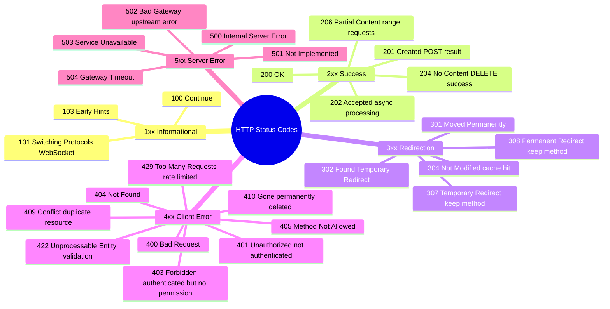

# HTTP Status Codes

> **Status codes are a 3-digit number in the HTTP response that tells the client what happened.** The first digit indicates the class of response.

---

## The 5 Classes at a Glance

```
1xx — Informational   → "I got your request, still processing"
2xx — Success         → "It worked"
3xx — Redirection     → "Go look somewhere else"
4xx — Client Error    → "You did something wrong"
5xx — Server Error    → "I messed up"
```

---

> The HTTP status codes 401 and 403 have misleading names:
    > - **401 Unauthorized** actually means *Unauthenticated* — "I don't know who you are"
    > - **403 Forbidden** actually means *Unauthorized* — "I know you, but you're not allowed"

## Mindmap: All Status Code Families



---

## 1xx — Informational

| Code | Name | When |
|------|------|------|
| `100` | Continue | Server received headers, client should proceed with body (large uploads) |
| `101` | Switching Protocols | WebSocket handshake — upgrading from HTTP |
| `102` | Processing | WebDAV — server is processing, no response yet |
| `103` | Early Hints | Send headers to start preloading resources before full response |

> **101** is the most interview-relevant: it's the response to `Upgrade: websocket`.

---

## 2xx — Success

| Code | Name | Typical Use |
|------|------|-------------|
| `200` | OK | Successful GET, successful PUT/PATCH response |
| `201` | Created | Resource created via POST — include `Location` header |
| `202` | Accepted | Request accepted but processed async (job queued) |
| `204` | No Content | Successful DELETE, successful PUT with no body needed |
| `206` | Partial Content | Range request (`Range: bytes=0-999`) — video streaming |

### When to use each 2xx

```
GET   /users/42     → 200 OK          (with body)
POST  /users        → 201 Created     (with Location: /users/42)
PUT   /users/42     → 200 OK          (return updated resource)
                    or 204 No Content (no body returned)
DELETE /users/42    → 204 No Content  (no body)
POST  /jobs         → 202 Accepted    (background job started)
```

---

## 3xx — Redirection

| Code | Name | When | Method preserved? |
|------|------|------|-------------------|
| `301` | Moved Permanently | Resource permanently at new URL | ❌ (may change to GET) |
| `302` | Found | Temporary redirect | ❌ (may change to GET) |
| `304` | Not Modified | ETag/cache validation — use cached version | — |
| `307` | Temporary Redirect | Same as 302 but method **must** stay same | ✅ |
| `308` | Permanent Redirect | Same as 301 but method **must** stay same | ✅ |

### 301 vs 307 vs 308

```
POST /old-endpoint
  301 → Client may re-send as GET /new-endpoint (loses POST!)
  307 → Client must re-send as POST /new-endpoint (method preserved) ✅
  308 → Like 307 but permanent

Use 308 when permanently moving a POST/PUT/DELETE endpoint.
Use 301 only for GET redirects (e.g., domain migration).
```

### 304 — The Caching Code

```
Client: GET /api/user/1
        If-None-Match: "etag-abc123"

Server: 304 Not Modified   ← No body sent, client uses cache
    or: 200 OK             ← Resource changed, new body + new ETag
```

---

## 4xx — Client Errors

| Code | Name | Meaning | When |
|------|------|---------|------|
| `400` | Bad Request | Malformed request syntax | Invalid JSON, missing required field |
| `401` | Unauthorized | Not authenticated | No token, expired token, invalid token |
| `403` | Forbidden | Authenticated but not authorized | Valid token, but no permission |
| `404` | Not Found | Resource doesn't exist | Wrong ID, wrong URL |
| `405` | Method Not Allowed | Wrong HTTP method | POST on read-only endpoint |
| `408` | Request Timeout | Client too slow | Upload taking too long |
| `409` | Conflict | State conflict | Duplicate email, concurrent edit conflict |
| `410` | Gone | Permanently deleted | Resource existed but was removed |
| `415` | Unsupported Media Type | Wrong Content-Type | Sent XML when only JSON accepted |
| `422` | Unprocessable Entity | Valid format, invalid content | Passes JSON parse but fails validation |
| `429` | Too Many Requests | Rate limited | Exceeded API quota |

### 401 vs 403 — The Classic Confusion

```
401 Unauthorized → Wrong word, actually means "UNAUTHENTICATED"
  "I don't know who you are — please log in"
  Usually: missing/invalid/expired token

403 Forbidden → UNAUTHORIZED (despite 401's misleading name)
  "I know who you are, but you can't do this"
  Usually: valid auth, insufficient permissions

Memory trick: 401 = no ID (who are you?), 403 = ID but blocked (I know you, but no)
```

### 404 vs 410

```
404 Not Found  → Resource doesn't exist (or shouldn't be revealed to exist)
410 Gone       → Resource USED to exist but was permanently deleted

Use 410 when:
  - Content was removed deliberately
  - You want search engines to stop indexing it
  - Important to distinguish "never existed" from "was deleted"
```

### 422 vs 400

```
400 Bad Request       → The request is syntactically invalid
  Example: malformed JSON { "name": "Madhu" ]  ← bad JSON

422 Unprocessable     → Syntactically valid but semantically wrong
  Example: { "age": -5 }     ← valid JSON, but age can't be negative
           { "email": "notanemail" } ← valid JSON, fails email validation
```

### 429 — Rate Limiting Response

```
HTTP/1.1 429 Too Many Requests
Retry-After: 60                        ← Try again in 60 seconds
X-Rate-Limit-Limit: 100               ← 100 requests allowed
X-Rate-Limit-Remaining: 0             ← 0 left
X-Rate-Limit-Reset: 1704067200        ← Unix timestamp when it resets

{ "error": "Rate limit exceeded. Try again in 60 seconds." }
```

---

## 5xx — Server Errors

| Code | Name | Meaning | Typical Cause |
|------|------|---------|---------------|
| `500` | Internal Server Error | Generic server crash | Unhandled exception, bug |
| `501` | Not Implemented | Method not supported | Server doesn't implement the feature |
| `502` | Bad Gateway | Upstream server error | App server crashed (nginx gets bad response) |
| `503` | Service Unavailable | Server down or overloaded | Deployment, maintenance, overwhelmed |
| `504` | Gateway Timeout | Upstream too slow | Database query timeout, slow service |
| `507` | Insufficient Storage | Out of disk | Server disk full |

### 500 vs 502 vs 503 vs 504

```
Your request goes:  Browser → Nginx → App Server → Database

500 Internal Server Error
  → App Server crashed / unhandled exception
  → Nginx forwarded the error response

502 Bad Gateway
  → Nginx connected to App Server but got garbage back
  → App Server is down or returning malformed response

503 Service Unavailable
  → Nginx couldn't connect to App Server at all
  → App Server process not running / restart in progress
  → Include Retry-After header!

504 Gateway Timeout
  → Nginx connected but App Server took too long
  → Usually a slow database query or external API timeout
```

```
Memory trick:
  502 = Bad Gateway   → Got a bad response
  503 = No Service    → Can't connect at all
  504 = Slow          → Connected but timed out
```

---

## Quick Reference Card

```
Most commonly used in REST APIs:
───────────────────────────────
200  OK                → Standard success
201  Created           → POST created resource
204  No Content        → DELETE / PUT no response body
304  Not Modified      → Cache hit (ETag match)
400  Bad Request       → Malformed request
401  Unauthorized      → Not logged in
403  Forbidden         → Logged in but no permission
404  Not Found         → Resource doesn't exist
409  Conflict          → Duplicate or state conflict
422  Unprocessable     → Validation error (valid format, bad values)
429  Too Many Requests → Rate limited
500  Internal Error    → Server bug
502  Bad Gateway       → Upstream service error
503  Unavailable       → Service down
504  Gateway Timeout   → Upstream too slow
```

---

## Status Code Decision Tree

```
Request received by server:
        │
        ▼
Is the request syntactically valid?
  No  → 400 Bad Request
  Yes ↓
Is the user authenticated?
  No  → 401 Unauthorized
  Yes ↓
Does the user have permission?
  No  → 403 Forbidden
  Yes ↓
Does the resource exist?
  No  → 404 Not Found
       (or 410 Gone if it used to exist)
  Yes ↓
Is there a method/state conflict?
  Yes → 405 Method Not Allowed
      → 409 Conflict
  No  ↓
Does it pass business validation?
  No  → 422 Unprocessable Entity
  Yes ↓
Is the server rate limiting?
  Yes → 429 Too Many Requests
  No  ↓
Was a new resource created?
  Yes → 201 Created
Is there a response body?
  Yes → 200 OK
  No  → 204 No Content
```

---

> **Interview tips:**
> - 401 vs 403 distinction is almost always asked — know it cold
> - 400 vs 422 — syntax vs semantic validation
> - 502 vs 503 vs 504 distinction (upstream issues)
> - Why GraphQL always returns 200 (errors are in the body)
> - Return 201 + Location header when creating resources via POST
