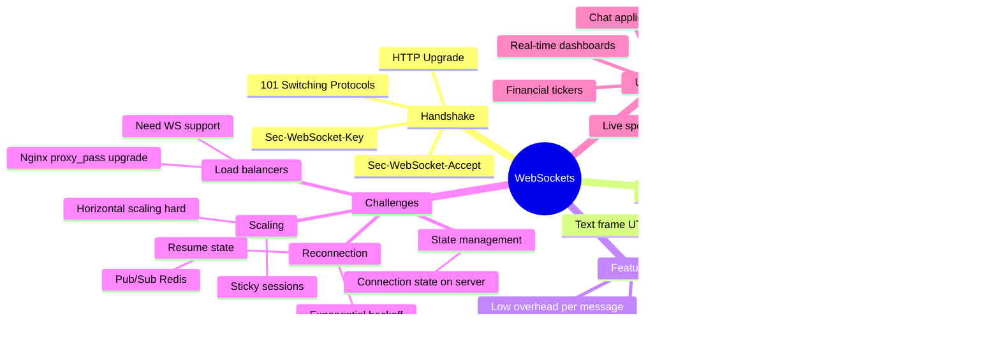

# WebSockets

> **WebSockets provide a persistent, full-duplex communication channel over a single TCP connection.** After the initial HTTP handshake, either side can send messages at any time — no request-response cycle required.

---

## The Problem WebSockets Solve

```
HTTP Polling (inefficient):
─────────────────────────
Client: "Any new messages?"  → Server: "No"
Client: "Any new messages?"  → Server: "No"
Client: "Any new messages?"  → Server: "No"
Client: "Any new messages?"  → Server: "Yes! Here they are"
(Wasted requests, high latency)

Long Polling (better, but still heavy):
────────────────────────────────────────
Client: "Give me new messages (wait up to 30s)" → Server: [holds connection]
                                                   Server: "Here's a message!" (30s later)
Client: "Give me new messages (wait up to 30s)" → Server: [holds connection]
...
(Better, but still HTTP overhead per cycle)

WebSocket (ideal for real-time):
─────────────────────────────────
Client ←──── persistent TCP connection ────▶ Server
              (both send whenever they want)
```

---

## The WebSocket Handshake

> WebSockets start as HTTP and then "upgrade" to the WebSocket protocol.

```
Client → Server (HTTP Upgrade Request):
────────────────────────────────────────
GET /chat HTTP/1.1
Host: api.example.com
Upgrade: websocket
Connection: Upgrade
Sec-WebSocket-Key: dGhlIHNhbXBsZSBub25jZQ==  ← random base64 nonce
Sec-WebSocket-Version: 13
Origin: https://myapp.com

Server → Client (101 Switching Protocols):
──────────────────────────────────────────
HTTP/1.1 101 Switching Protocols
Upgrade: websocket
Connection: Upgrade
Sec-WebSocket-Accept: s3pPLMBiTxaQ9kYGzzhZRbK+xOo=  ← derived from nonce

──── HTTP ends here. WebSocket begins. ────

Now both sides can send frames freely:
Client → Server: { "type": "message", "text": "Hello!" }
Server → Client: { "type": "message", "text": "Hi back!" }
Server → Client: { "type": "presence", "user": "Madhu", "status": "online" }
```

---

## WebSocket Architecture



---

## Browser WebSocket API

```javascript
// Connect
const ws = new WebSocket('wss://api.example.com/ws');
// wss:// = WebSocket Secure (like https:// for WS)
// ws://  = unencrypted (avoid in production)

// Connection opened
ws.addEventListener('open', () => {
  console.log('Connected!');
  ws.send(JSON.stringify({ type: 'subscribe', channel: 'chat' }));
});

// Receive message
ws.addEventListener('message', (event) => {
  const data = JSON.parse(event.data);
  console.log('Received:', data);
});

// Connection closed
ws.addEventListener('close', (event) => {
  console.log('Closed:', event.code, event.reason);
  // Reconnect logic here
});

// Error
ws.addEventListener('error', (error) => {
  console.error('WebSocket error:', error);
});

// Send a message
ws.send(JSON.stringify({ type: 'message', text: 'Hello!' }));

// Close gracefully
ws.close(1000, 'User disconnected');
```

---

## WebSocket Close Codes

| Code | Meaning |
|------|---------|
| `1000` | Normal closure |
| `1001` | Going away (navigated away, server restart) |
| `1002` | Protocol error |
| `1003` | Unsupported data type |
| `1006` | Abnormal closure (no close frame received) |
| `1007` | Invalid data (e.g., non-UTF-8 in text frame) |
| `1008` | Policy violation |
| `1009` | Message too large |
| `1011` | Server internal error |

---

## Reconnection with Exponential Backoff

```javascript
class ReconnectingWebSocket {
  constructor(url) {
    this.url = url;
    this.reconnectDelay = 1000;  // start at 1 second
    this.maxDelay = 30000;       // max 30 seconds
    this.connect();
  }

  connect() {
    this.ws = new WebSocket(this.url);

    this.ws.onopen = () => {
      console.log('Connected');
      this.reconnectDelay = 1000;  // reset on success
    };

    this.ws.onclose = () => {
      console.log(`Reconnecting in ${this.reconnectDelay}ms...`);
      setTimeout(() => this.connect(), this.reconnectDelay);
      // Exponential backoff with jitter
      this.reconnectDelay = Math.min(
        this.reconnectDelay * 2 + Math.random() * 1000,
        this.maxDelay
      );
    };

    this.ws.onmessage = (event) => {
      const data = JSON.parse(event.data);
      this.handleMessage(data);
    };
  }

  send(data) {
    if (this.ws.readyState === WebSocket.OPEN) {
      this.ws.send(JSON.stringify(data));
    }
  }
}
```

> **Jitter** (the `Math.random() * 1000`) prevents all clients from reconnecting simultaneously after a server restart — also called the "thundering herd" problem.

---

## Scaling WebSockets

> The hardest part of WebSockets in production. Each connection is stateful and lives on one server.

### The Problem

```
Load Balancer
      │
   ┌──┴──┐
   ▼     ▼
Server1  Server2
 [userA] [userB]

userA sends a message to userB.
Server1 has no connection to userB → can't deliver!
```

### Solution: Pub/Sub with Redis

```
Load Balancer
      │
   ┌──┴──┐
   ▼     ▼
Server1  Server2
 [userA] [userB]
   │         │
   └────┬────┘
        ▼
      Redis
    (Pub/Sub)

userA sends message to userB:
  Server1 → publish to Redis channel "user:B"
  Server2 is subscribed → receives → sends to userB's WebSocket ✅
```

### Nginx Config for WebSocket Proxy

```nginx
server {
  listen 443 ssl;

  location /ws {
    proxy_pass http://backend;
    proxy_http_version 1.1;
    proxy_set_header Upgrade $http_upgrade;       # Required for WS
    proxy_set_header Connection "upgrade";         # Required for WS
    proxy_set_header Host $host;
    proxy_read_timeout 3600s;                      # Keep alive for 1 hour
  }
}
```

---

## Message Protocol Design

> WebSockets are just a pipe. You design the message format on top.

```javascript
// Common pattern: type + payload
{
  "type": "chat.message",
  "payload": {
    "channelId": "general",
    "text": "Hello everyone!",
    "userId": "42"
  },
  "id": "msg-uuid-here",     // For ack tracking
  "timestamp": 1704067200
}

// Server acknowledgment
{
  "type": "ack",
  "id": "msg-uuid-here",
  "status": "delivered"
}

// Heartbeat / keepalive
{
  "type": "ping"
}
{
  "type": "pong"
}

// Error
{
  "type": "error",
  "code": "UNAUTHORIZED",
  "message": "Token expired"
}
```

---

## WebSocket vs SSE vs Polling

```
┌──────────────────┬───────────────┬───────────────┬────────────────┐
│                  │ WebSocket     │ SSE           │ Long Polling   │
├──────────────────┼───────────────┼───────────────┼────────────────┤
│ Direction        │ Full-duplex   │ Server → only │ Server → only  │
│ Protocol         │ WS (over TCP) │ HTTP          │ HTTP           │
│ Browser support  │ All modern    │ All modern    │ All            │
│ Reconnect        │ Manual        │ Auto          │ Manual         │
│ Overhead         │ Low per msg   │ Low           │ High per cycle │
│ Load balancing   │ Hard (sticky) │ Easier        │ Easy           │
│ HTTP/2 compat    │ Separate conn │ Multiplexed   │ Multiplexed    │
│ Best for         │ Chat, games   │ Notifications │ Fallback       │
└──────────────────┴───────────────┴───────────────┴────────────────┘
```

---

## WebSocket readyState Values

```javascript
WebSocket.CONNECTING  // 0 — Handshaking
WebSocket.OPEN        // 1 — Connected and ready
WebSocket.CLOSING     // 2 — Close handshake in progress
WebSocket.CLOSED      // 3 — Connection closed

// Check before sending:
if (ws.readyState === WebSocket.OPEN) {
  ws.send(message);
}
```

---

> **Interview tips:**
> - Explain the HTTP → WS upgrade handshake (101 Switching Protocols)
> - Full-duplex = both sides send without waiting — contrast with SSE (server-only)
> - Scaling is the hardest part — Redis pub/sub is the standard answer
> - Exponential backoff + jitter for reconnection (thundering herd)
> - WebSockets are stateful — this makes horizontal scaling complex
