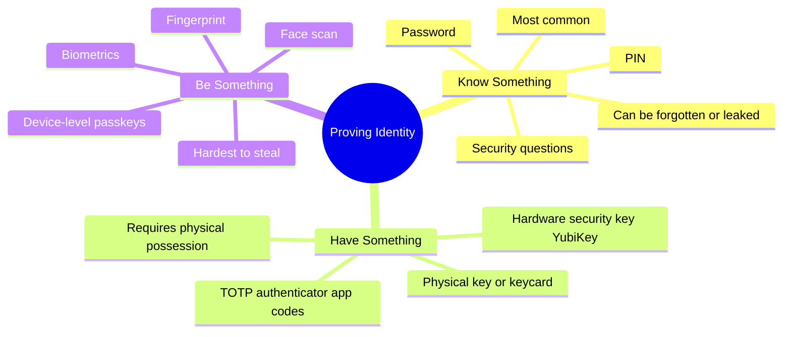
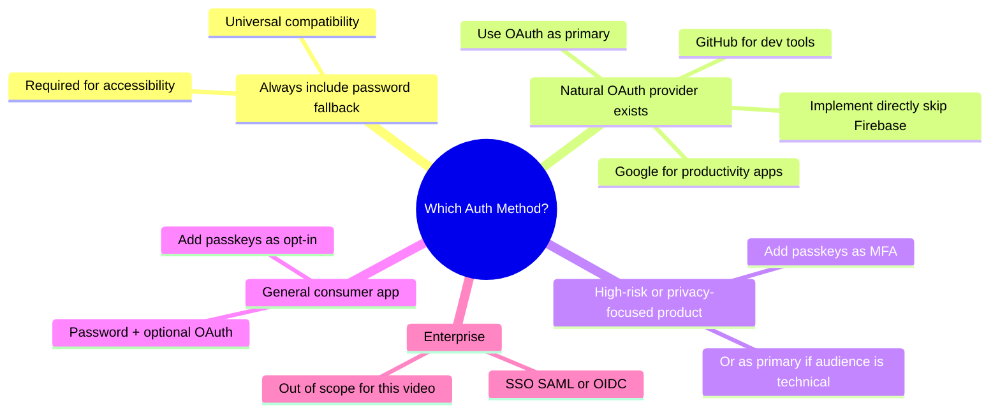

# Authentication is a Developer Nightmare

> Authentication is conceptually simple — verify the user is who they say they are. In practice it's a convoluted mess of vulnerabilities, dependencies, and buggy edge cases. This is an honest look at all three approaches: passwords, OAuth, and passkeys.

---

## Why It's Hard

```
The web is an open, trustless protocol.
Anyone can send any request pretending to be anyone.

And the distrust goes BOTH directions:
  You    →  wary of bad actors trying to access your database
  Users  →  wary of your website misusing their data

There is no perfect answer. Every mechanism has trade-offs.
```

**Authentication vs Authorization — don't mix them:**

```
Authentication  →  "Who are you?"    Verify identity
Authorization   →  "What can you do?" Verify permissions
```

---

## The Three Factors of Authentication



> Multi-factor authentication (MFA) combines two or more of these. A stolen password alone isn't enough if the attacker also needs your phone.

---

## Approach 1: Password Authentication

> The most boring, most understood, and most universally supported approach. A user proves identity by knowing a secret string associated with their account.

### The Core Flow

```
Registration:
  1. User provides username + password
  2. Server generates a random salt (unique per user)
  3. Server hashes:  SHA-256(password + salt)  →  hashed_password
  4. Server stores:  { user_id, username, hashed_password, salt }
  5. Password itself is NEVER stored

Sign-in:
  1. User provides username + password
  2. Server fetches user record → retrieves stored salt
  3. Server hashes:  SHA-256(provided_password + salt)
  4. Compare with stored hash:
       match     →  create session token → set HttpOnly cookie ✅
       no match  →  401 Unauthorized ❌
```

### Why Hashing + Salting?

```
Plain text storage (NEVER do this):
  DB leak → attacker has every user's password directly

Hashed only (bad):
  SHA-256("password123") is always the same hash
  Attacker uses rainbow tables: precomputed hash → password lookups
  Every user with "password123" has the SAME hash → one lookup cracks all of them

Hashed + salted (correct):
  salt = random UUID generated per user
  SHA-256("password123" + "a7f3c9d2-...") is unique for every user
  Rainbow tables are useless — attacker must brute-force each user individually
```

```python
# Registration (Kotlin-style pseudocode → applies to any language)
val salt = UUID.randomUUID().toString()
val hashedPassword = SHA256(password + salt)
db.save(userId, username, hashedPassword, salt)

# Sign-in
val user = db.findByUsername(username)
val attemptHash = SHA256(providedPassword + user.salt)
if (attemptHash == user.hashedPassword) createSession(user.id)
```

### The Password Reset Problem

> The moment you add passwords, you inherit the reset problem. Users forget passwords. Users leak passwords. You can't avoid building this.

```
Reset flow:
  1. User clicks "Forgot password" → enters email
  2. Server generates a one-time code → stores {code, email, expiry}
  3. Server sends email with link: https://yourapp.com/reset?code=abc123
  4. User follows link → enters new password
  5. Server: fetch user by code → validate expiry → re-salt + re-hash new password
  6. Invalidate the one-time code

Complexity added:
  ✅ SMTP client (sending emails)
  ✅ One-time code storage and expiry
  ✅ Secure code generation
  ✅ Reset page UI
```

!!! note "The insight this reveals"
    Once you're sending a reset link to an email, **you're already using email as an authentication method**. Anyone who can access the inbox can access the account. This begs the question: why make users remember an extra password at all?

### Pros, Cons, When

| ✅ Pros | ❌ Cons |
|---------|---------|
| Simple to understand and implement | Password reset is non-trivial infrastructure |
| No third-party dependency | Users forget, reuse, and leak passwords |
| Works everywhere | Plain text storage risk if you make mistakes |
| Universal fallback | Brute-force and credential stuffing attacks |
| Full control over the system | Phishing — users tricked into entering on fake sites |

---

## Approach 2: OAuth 2.0 (Social Sign-In)

> OAuth 2.0 lets users authenticate via a third-party they already trust (Google, GitHub, Apple). Your app never sees their password — only a verified token from the provider.

### The Flow

```
1. User clicks "Sign in with GitHub"
2. Your app redirects to GitHub with:
   - client_id   (your public app ID)
   - redirect_uri (where GitHub sends the code back)
   - state       (random unguessable value — prevents CSRF / man-in-the-middle)

3. User logs into GitHub, approves requested permissions (e.g. read email)

4. GitHub redirects back to your redirect_uri with:
   ?code=one_time_code&state=your_state_value

5. Your SERVER (not client) sends to GitHub:
   POST /login/oauth/access_token
   { client_id, client_secret, code }
   → GitHub returns an access_token

6. Your server uses access_token to fetch user details from GitHub API
   GET /user  →  { id, email, name, avatar_url }

7. Create your own session for the user → set HttpOnly cookie
```

```
Why the `state` parameter matters:
  Without it:  attacker crafts a link with their own OAuth code
               → victim clicks → their account is linked to attacker's identity
  With state:  code is only accepted if state matches what YOUR server generated
               Man-in-the-middle attacks blocked ✅
```

### Setup Required (GitHub Example)

```
GitHub App Settings:
  Client ID:      public — safe to expose in frontend
  Client Secret:  private — only on your server, never in client code
  Origin:         https://yourapp.com  (where requests come from)
  Redirect URL:   https://yourapp.com/auth/callback  (where code is sent)
```

### The Big Provider Problem

!!! warning "Google, Facebook, and Apple are a nightmare to work with"

    **Google:**
    - Requires a full privacy policy and terms of service before submission
    - App goes through a review process that can take days
    - Can revoke your access at any time with no recourse

    **Facebook:**
    - Similar review process PLUS requires HTTPS on localhost (you need tunnels for local dev)
    - True story from the transcript: Facebook sent unclear requirements with a short deadline, didn't respond to support tickets, then shut down authentication for a multi-billion dollar company. The only resolution was their CTO threatening to pull millions in Facebook ad spend.

    **GitHub:**
    - What you'd expect OAuth to be. Straightforward, no political hurdles, works as documented.

    > *"If all providers were as pleasant as GitHub I would have a much easier time praising OAuth. The problem is that you are now at the mercy of these other companies."*

### The Supabase / Firebase / Auth0 Question

> These services abstract OAuth, password auth, and session management. Are they worth it?

```
What they solve:
  ✅ OAuth plumbing (code → token exchange)
  ✅ User database
  ✅ Email templates
  ✅ Some security best practices baked in

What they don't solve:
  ❌ The provider approval process (you still deal with Google/Facebook review)
  ❌ The dependency risk (they can deprecate features, change pricing, go down)
  ❌ Complexity (deprecation notices forwarded from Auth0 originally from Google — who are you even talking to?)
  ❌ Added communication layer that can fail

The honest assessment:
  Implementing OAuth directly is NOT significantly more work than integrating with these services.
  But using them adds a dependency that can fail or cut you off.

  Recommendation: implement OAuth and password auth yourself.
                  It's not that much code. You own it. Nobody can pull the rug.
```

### OAuth Pros, Cons, When

| ✅ Pros | ❌ Cons |
|---------|---------|
| No password management for you | Provider approval process (Google/Facebook) |
| Leverages user's existing secure account | You depend on third-party availability |
| Most people already use these platforms | Provider can revoke access at any time |
| No password reset infrastructure needed | HTTPS required for some providers (Facebook) |
| GitHub/Apple are reasonable to work with | State/CSRF implementation required |

---

## Approach 3: Passkeys / WebAuthn

> Passkeys use a **public/private key pair** stored on the user's device or password manager. No password is ever created, stored, or transmitted. The server never sees private data.

### The Key Pair Concept

```
Asymmetric cryptography:
  Private key:  stays on the device / password manager. Never shared. Never transmitted.
  Public key:   sent to and stored by your server.

Sign with private key → anyone with the public key can verify the signature.
But you can't derive the private key from the public key (one-way).
```

### Registration Flow

```
1. User clicks "Register with passkey"
2. Browser / device / password manager generates a new key pair
3. Device prompts user: biometric (fingerprint/face) or PIN to approve

4. Client sends to server:
   { publicKey, algorithm, challenge_response }
   The challenge was sent by the server — proves this is a fresh registration (not a replay)

5. Server verifies the challenge → stores { user_id, publicKey, algorithm }
   Private key never leaves the device ✅
```

### Sign-In Flow

```
1. Server sends a fresh challenge (random bytes)
2. User's device signs the challenge with their private key
   (biometric or PIN prompts the device to use the key)
3. Client sends signed challenge to server

4. Server:
   fetch stored publicKey for this user
   verify(signedChallenge, publicKey)  →  match? ✅ or ❌
   
5. No password. No secret transmitted. Nothing to phish.
```

### The Device Problem

```
Passkeys tied to a device:
  ✅ Incredibly secure — private key never leaves hardware
  ❌ What if the device is lost, broken, or stolen?
  ❌ What if you need to sign in on someone else's computer?
  ❌ Users need a recovery path — back to email or another device

Passkeys in a password manager (the better approach):
  ✅ Syncs across your devices
  ✅ Works anywhere you have access to your password manager
  ✅ Not tied to one physical device
  ✅ Password managers handle backup and recovery

  "Using a password manager lets you avoid the headaches of
   passwords being logged to a device while still getting all the benefits of passkeys."
```

### Why Passkeys Are the Ideal Endgame

```
Your app stores:  public key only — no secrets, no passwords
Phishing:         useless — the key is domain-bound, won't work on a fake site
Password reset:   doesn't exist — nothing to forget or reset
Database leak:    no passwords to expose
MFA built-in:     biometric prompt IS the second factor

"This is the way authentication should be done, in my opinion."
```

### The Adoption Problem

```
Current reality (2024):
  Most users use a browser's built-in password manager whether they know it or not.
  Passkey-style UX is appearing in Chrome, Safari, iOS, Android — growing fast.
  But not everyone understands or trusts "sign in with passkey" yet.

Recommendation:
  High-risk or privacy-focused product? Passkeys are a great fit.
  Excellent as a second factor (MFA) alongside passwords.
  Still too early to use as the ONLY auth method for a general audience.
```

### Passkey Pros, Cons, When

| ✅ Pros | ❌ Cons |
|---------|---------|
| No password to forget, leak, or phish | Unfamiliar to many users |
| Server stores no secret data | Device loss recovery is complex |
| Domain-bound — immune to phishing | Requires JavaScript on the client |
| Biometric / PIN UX is familiar now | More complex server implementation |
| Works with password managers | Adoption still growing |

---

## The Full Comparison

```
┌──────────────────────┬──────────────────┬──────────────────┬──────────────────┐
│                      │ Password         │ OAuth 2.0        │ Passkeys         │
├──────────────────────┼──────────────────┼──────────────────┼──────────────────┤
│ Complexity           │ Low–Medium       │ Medium           │ Medium–High      │
│ Third-party dep      │ None             │ Provider         │ Browser/OS API   │
│ Password to remember │ Yes              │ No (use theirs)  │ No               │
│ Phishable            │ Yes              │ Partially        │ No (domain-bound)│
│ Reset flow needed    │ Yes              │ No               │ No               │
│ Works everywhere     │ Yes              │ Most places      │ Modern browsers  │
│ Data stored server   │ Hash + salt      │ User ID + token  │ Public key only  │
│ Provider risk        │ None             │ High (Google etc)│ None             │
│ User familiarity     │ Universal        │ High             │ Growing          │
└──────────────────────┴──────────────────┴──────────────────┴──────────────────┘
```

---

## Decision Framework



```
Simple rule of thumb:
  Start with password auth.          Simple, boring, works everywhere.
  Add OAuth if there's a clear fit.  GitHub for devtools, Google for productivity.
  Add passkeys as MFA or future-proofing. The right direction.
  Skip Supabase/Firebase for OAuth.  Direct integration isn't harder.
  Never use Facebook OAuth.          The horror story speaks for itself.
```

---

## Quick Reference

```
Password auth:
  Store:   SHA-256(password + random_salt) + the salt
  Never:   plain text passwords, unsalted hashes
  Add:     reset flow via email one-time code (adds SMTP dependency)
  Session: create opaque session token on successful login

OAuth 2.0:
  Flow:    redirect → code → server exchanges code for token → fetch user → create session
  State:   always include state param (CSRF/man-in-the-middle protection)
  Avoid:   Facebook. Be cautious with Google. GitHub is great.
  Skip:    Supabase/Firebase for OAuth — direct integration is equally simple

Passkeys:
  Keys:    device generates key pair; public key stored on server; private key never leaves device
  Flow:    server sends challenge → device signs with private key → server verifies with public key
  Best:    with a password manager for cross-device portability
  Use for: high security, phishing resistance, MFA, future default

All three:
  Always use HTTPS
  Session token = HttpOnly + Secure + SameSite cookie
  Never store passwords in plain text
  Never roll your own hashing — use established libraries
```
