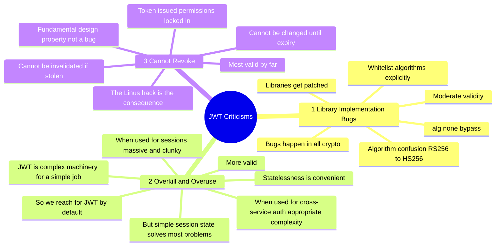

# JWTs Are Overrated

> JWTs are powerful and widely adopted — but they're massively overused. They're an excellent tool for one specific job: one-time cross-service authentication. Using them as general-purpose session tokens is where developers go wrong.

---

## The Real-World Cost: The Linus Tech Tips Hack (2023)

!!! danger "March 2023 — Linus Media Group"
    An employee unknowingly opened a malicious `.exe`. It silently **copied active browser session tokens** from their machine — including all active sessions for their YouTube accounts — and sent them to the attacker's computer.

    The attacker used those stolen tokens to hijack three major YouTube channels and run a crypto scam. But the most damaging part wasn't the initial breach. It was this:

    > **Even after regaining control of the accounts, there was no way to immediately remove the hacker's access.**

    The session tokens were still valid. There was no kill switch.

    > *"I'm fairly sure this particular issue wasn't caused by JWTs, but it is a great example of the kind of vulnerability you open yourself up to when using them as a session token."*

    This is the revocation problem made concrete. When your tokens can't be invalidated, a breach becomes a siege.

---

## Stateful vs Stateless Tokens — The Core Distinction

```
Stateful token (opaque session):
  Token  →  just a random ID
  Data   →  stored on the SERVER

  Server can:  revoke instantly ✅
               update permissions ✅
               see all active sessions ✅

Stateless token (JWT):
  Token  →  contains the data itself, signed
  Data   →  stored IN the TOKEN

  Server can:  verify the signature ✅
               NOT revoke (no record of it) ❌
               NOT update permissions after issuance ❌
```

> *"This adjective is referring to the service state, not the token."*
> Stateless means the **server** holds no state about you — not that the token has no state.

---

## What JWT Actually Is

A JWT has three Base64url-encoded parts separated by dots:

```
[Header].[Payload].[Signature]
```

**Header** — metadata, crucially the signing algorithm:
```json
{ "alg": "HS256", "typ": "JWT" }
```

**Payload** — the actual data (subject, issuer, expiry, custom fields):
```json
{
  "sub": "user_42",
  "role": "admin",
  "exp": 1704067200,
  "iat": 1704063600
}
```

**Signature** — computed by signing header + payload with the chosen algorithm:
```
sign(base64(header) + "." + base64(payload), key)
```

The signature means **any service can verify the token without calling back to the issuer** — this is the portability that makes JWTs appealing, and also the source of their problems.

---

## The Three Criticisms of JWTs



### Criticism 1 — Library Bugs (Moderate Validity)

The most notorious exploit: passing `"alg": "none"` in the header caused some libraries to skip signature verification entirely. Others were vulnerable to algorithm confusion — switching `RS256` to `HS256` to forge tokens.

```
Attack: change header to { "alg": "none" }
        → some libraries: "no algorithm = no signature check" → accepts any payload ❌

Fix: always explicitly whitelist accepted algorithms

  # Python
  jwt.decode(token, secret, algorithms=["HS256"])

  # Node.js
  jwt.verify(token, secret, { algorithms: ["HS256"] })
```

Cryptography is hard. Mistakes happen in every standard. What matters is that they get fixed and best practices get updated. This criticism is somewhat overstated — it's an argument to use good libraries and pin algorithms, not an argument against JWTs.

### Criticism 2 — Overkill (More Valid)

> *"Statelessness is very convenient, leading many to choose a complex token mechanism over a simple state solution."*

When used for their intended purpose — **cross-service authentication** — JWTs are about as complex as they need to be. When used as session tokens, they're massive and clunky. The problem isn't the tool; it's reaching for it habitually.

### Criticism 3 — Cannot Revoke (Most Valid)

> *"This issue is a smell that something is wrong with the way JWTs are used and that they aren't suitable as session tokens."*

```
Opaque token revocation:   DELETE FROM sessions WHERE token = 'x'   → instant ✅
JWT revocation:             ??? the server has no record of it        → impossible ❌

When a JWT is issued, the expiration date and permissions are locked in.
They cannot be changed. The token is client-authoritative.
```

This isn't a bug. It's the design. And it means:

- A fired employee's token is still valid until it expires
- A stolen token cannot be killed remotely
- A security breach cannot be contained by revoking sessions

> *"The existence of this vulnerability at all is a clear indication that stateless tokens are not well suited for managing sessions."*

The only fix — a server-side blacklist of revoked JWTs — immediately defeats the statelessness advantage. At that point, you're managing server state for tokens anyway. You may as well use a stateful session and get all the benefits.

---

## When to Actually Use JWTs

The argument isn't "never use JWTs." It's **match the tool to the job**.

### Case 1 — Single Server, Single Client → Don't Use JWT

```
Use an opaque session token instead.

  ✅ Smaller (just a random string, not a full signed document)
  ✅ Instantly revocable
  ✅ Permissions updateable server-side at any time
  ✅ Simpler implementation
  ✅ No signing, no algorithm selection, no library footguns

  "In almost all cases there is no need to store user data on the token.
   You can make use of caching to fetch user data efficiently."
```

The performance argument for JWTs often doesn't hold up:

```
Claim: "JWTs avoid DB calls"
Reality: Most endpoints need fresh user data anyway → DB call happens regardless
         JWT payload becomes stale the moment it's issued
         Role changed? Subscription cancelled? Too bad — JWT says otherwise until it expires.
```

### Case 2 — Cross-Service Auth (Services You Own) → Symmetric JWT, Once Only

```
Client has session with Service A.
Client needs access to Service B.

  1. Service A issues a signed JWT: "this client may talk to Service B" (HS256, short TTL)
  2. Client makes ONE request to Service B with that JWT
  3. Service B verifies → creates its OWN opaque session for the client
  4. The original JWT is rejected for any subsequent request

Key: the JWT is a handshake, not a session. Used once. Discarded.
```

```
Why symmetric (HS256) here:
  You own all the services → shared secret is acceptable
  Simpler and faster than asymmetric crypto
  No need to publish a public key
```

### Case 3 — Cross-Service Auth (External Service) → Asymmetric JWT, Once Only

```
Service A (external) issues a JWT signed with its private key.
Service B (yours) verifies with Service A's public key.

  ✅ Service A's private key never leaves their system
  ✅ Service B only needs the public key (safe to share openly)
  ✅ No shared secret to leak

Same rule: accept the token ONCE, then create your own session.
```

---

## The One-Time Token Pattern

> This is the key insight from this perspective. **Stateless tokens should really only be used once.**

```
❌ Wrong pattern (JWT as ongoing session):
   Login → get JWT → use JWT for every request forever (until expiry)
   Stolen JWT → attacker has full access until expiry. No kill switch.

✅ Right pattern (JWT as bootstrap handshake):
   Step 1:  Client authenticates → receives short-lived JWT
   Step 2:  Client presents JWT to target service ONCE
   Step 3:  Target service verifies → creates opaque session for client
   Step 4:  Client uses opaque session for all ongoing requests
   Step 5:  JWT is invalidated / no longer accepted
   
   Result:  JWT's portability used for its strength (no shared state needed for auth)
            Opaque session used for its strength (revocable, updateable)
```

---

## PASETO — A Cleaner Alternative

> PASETO (Platform-Agnostic Security Tokens) addresses JWT's footguns at the spec level.

```
JWT problem → PASETO fix:

  Algorithm agility (attacker picks alg)
    → PASETO: algorithm is baked into the version. Not configurable by the token.

  Payload is readable (only Base64)
    → PASETO local: payload is AES-256 ENCRYPTED. Unreadable without the key.

  Complex, error-prone spec
    → PASETO: simpler, fewer valid configurations, harder to misuse
```

| | JWT | PASETO |
|-|-----|--------|
| Payload | Base64 (readable) | Encrypted (local) or Signed (public) |
| Algorithm selection | In the header (attacker-controllable) | Fixed per version |
| `alg:none` attack | Possible in naive implementations | Not possible by design |
| Adoption | Ubiquitous | Growing, not yet universal |

```
PASETO versions:
  v3.local   →  symmetric encryption  (like HS256, but payload is encrypted)
  v4.public  →  asymmetric signing    (like RS256, but cleaner spec)

Use PASETO if: starting a new project, want fewer footguns, payload privacy matters
Use JWT if:   ecosystem compatibility required (most IdPs, libraries, tooling speak JWT)
```

---

## The Decision Rules — Simplified

```
Ongoing server-client session?
  → Opaque session token. Always. No debate.

One-time cross-service handshake (services you own)?
  → HS256 JWT. Short TTL. Accept once. Create your own session after.

One-time cross-service handshake (external service)?
  → RS256 JWT or PASETO public. Verify once. Create your own session after.

Absolute requirement for ongoing stateless sessions?
  → JWT with short expiry + refresh token rotation.
     Know what you're trading: stolen token = valid until expiry. No kill switch.
```

---

## Summary

```
JWTs are not bad. They're misused.

Their superpower:  cryptographically verifiable, portable, no shared state between services
Their kryptonite:  cannot be revoked, permissions locked at issuance, client-authoritative

The right mental model:
  JWT = a signed letter of introduction between services
        Present it once to establish trust. Then use a proper session.

  NOT: JWT = a long-lived badge you wear everywhere

Default to stateful opaque sessions.
Reach for JWTs when you genuinely need portable cross-service authentication.
Use them once. Then discard them.
```
