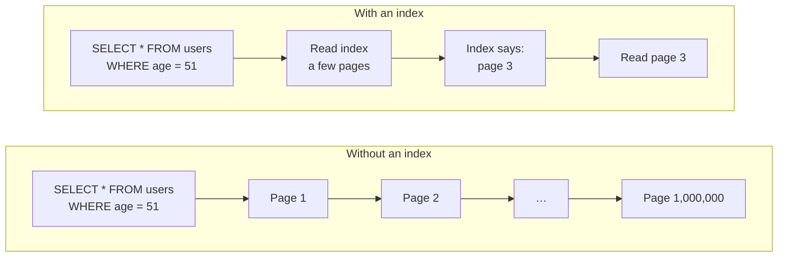
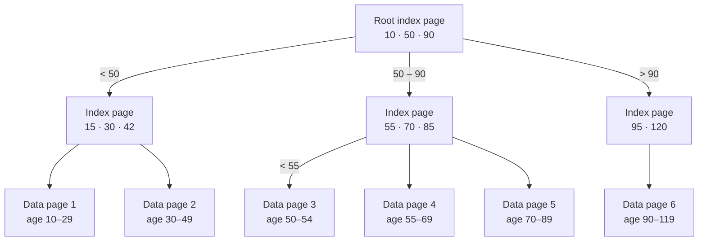
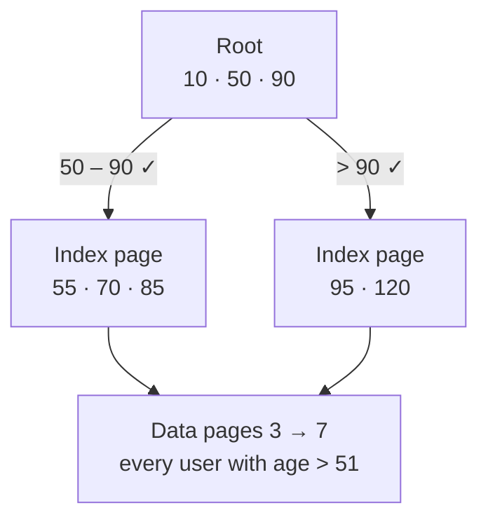
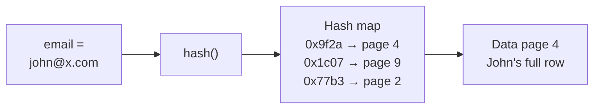
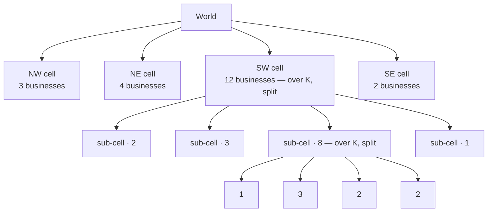
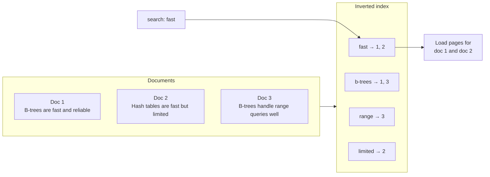
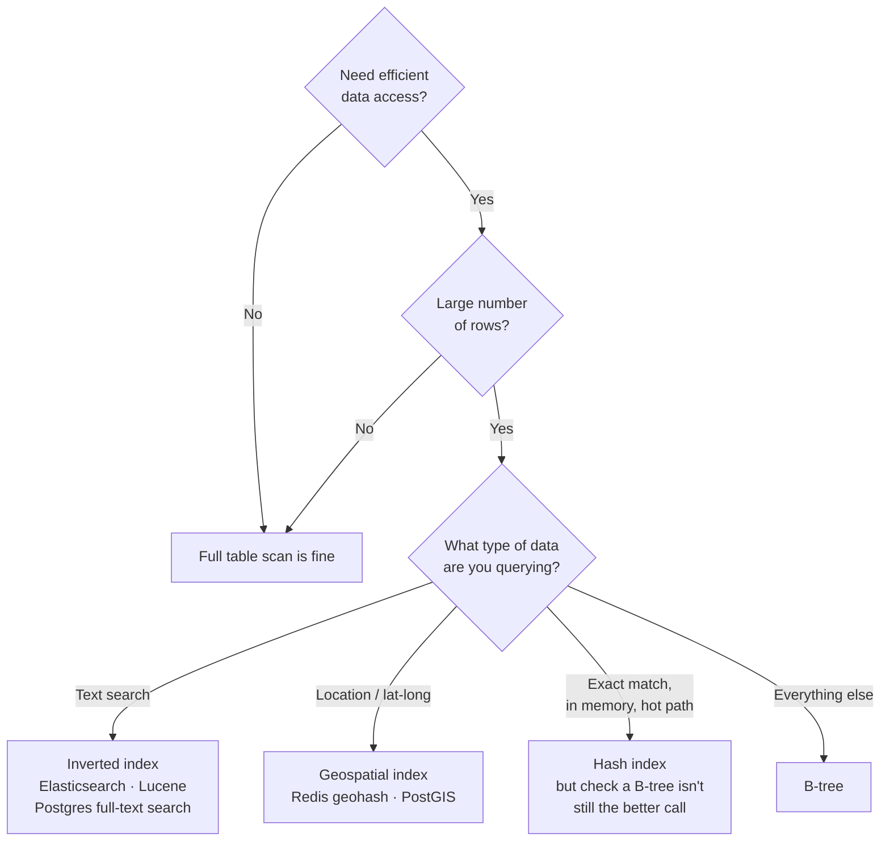

# Database Indexing

> **An index is a separate data structure on disk that tells the database *which page* a row lives on — so it can read one page instead of all of them.** Everything else (B-trees, hash indexes, geospatial indexes, inverted indexes) is just a different answer to the question: *what shape does that lookup structure need to be?*

---

## The Problem Indexes Solve

A database doesn't read rows. It reads **pages**.

| Unit | Typical size | Holds |
|------|-------------|-------|
| Page | ~8 KB | ~100 rows |
| Round trip SSD → RAM | ~100 µs | 1 page |

Without an index, finding a row means a **full table scan**: pull a page into memory, scan its ~100 rows, discard it, pull the next one — until you hit the row you want.

### The math that makes it real

```
100,000,000 users
÷       100 rows per page
= 1,000,000 pages

1,000,000 pages × 100 µs per read = 100 seconds  (worst case)
```

Real databases do better than this — prefetching, readahead, parallel I/O and caching typically drag it down to ~3–5 seconds. **The point survives anyway.** Nobody waits 3 seconds for a lookup by ID.

### What the index changes



An index is **stored on disk like everything else** — you pay a few page reads to walk it, then one page read to get the data. That's the whole trade.

---

## B-Tree — the default, and usually the right answer

A B-tree is the same tree you learned in DSA: **each node is a sorted list of values, each value paired with a pointer** — either to a child index page, or to an actual data page.

Every blue box below is one page on disk.



### Walking an exact match

```sql
SELECT * FROM users WHERE age = 51;
```

1. Pull the **root** page into memory → `51 > 50` and `51 < 90` → follow the middle pointer.
2. Pull that **index page** → `51 < 55` → that pointer says **page 3**.
3. Pull **page 3**. Done — every user aged 51 is there.

Three page reads instead of a million.

!!! note "Why the tree stays short"
    An 8 KB index page holds *hundreds* of key+pointer pairs, so the fan-out is huge. Even at 100M rows a B-tree is typically only **3–4 levels deep** — a lookup costs a handful of page reads, and the upper levels are almost always already cached in memory.

### Walking a range query

```sql
SELECT * FROM users WHERE age > 51;
```

The tree is **sorted**, so a range is just "descend to the start, then walk sideways":



Both subtrees to the right of `50` qualify, so we follow all of their pointers and load every matching data page. **This ordering property is the reason B-trees beat hash indexes in practice** — they serve exact matches, ranges, `ORDER BY`, and prefix matches from one structure.

---

## Hash Index — O(1), and still rarely what you want

A hash index is exactly a hash map on disk: hash the key, look up the bucket, get a pointer to the page holding the row.



| | Hash index | B-tree |
|---|---|---|
| Exact match | O(1) | O(log n) — but only ~3–4 page reads |
| Range query | ❌ impossible | ✅ |
| `ORDER BY` / sorting | ❌ | ✅ |
| Prefix match | ❌ | ✅ |

**Verdict:** B-trees are *nearly* as fast for exact matches and strictly more capable, so production relational databases default to B-trees. Hash indexes show up mainly in **in-memory stores like Redis**, where disk I/O patterns don't matter — useful history, useful for caching, rarely the answer for a table.

---

## Geospatial Indexes — when B-trees hit a wall

B-trees excel at **one-dimensional** data. Latitude *and* longitude is two-dimensional, and that breaks the model.

```sql
SELECT * FROM locations
WHERE  lat  BETWEEN 100 AND 400
  AND  long BETWEEN  20 AND 200;
```

With one B-tree per column, the database fetches two long **strips** of rows and merges them:

```
        long 20 ─────────── 200
             │             │
   lat 400 ──┼─────────────┼──   ← everything in the lat range
             │▓▓▓▓▓▓▓▓▓▓▓▓▓│      (one long strip)
             │▓▓ WANTED  ▓▓│
             │▓▓▓▓▓▓▓▓▓▓▓▓▓│    ← everything in the long range
   lat 100 ──┼─────────────┼──      (another long strip)
             │             │

   Both strips are loaded into memory, then merged.
   Only the ▓ intersection is actually wanted.
```

Both strips get pulled into memory and merged — expensive, and most of what you read is thrown away. **Geospatial indexes exist to collapse 2D proximity into something the storage engine can index directly.**

Three worth knowing:

### 1. Geohashing — turn 2D into a sortable string

Split the world into 4 cells, label them `0 1 2 3`. Recursively split each cell the same way. Each extra character = one more level of precision.

```
Level 1                      Level 2 (cell 2 subdivided)
┌──────────┬──────────┐      ┌──────────┬──────────┐
│          │          │      │          │          │
│    0     │    1     │      │    0     │    1     │
│          │          │      │          │          │
├──────────┼──────────┤      ├────┬─────┼──────────┤
│          │          │      │ 20 │ 21  │          │
│    2     │    3     │      ├────┼─────┤    3     │
│          │          │      │ 22 │ 23  │          │
└──────────┴──────────┘      └────┴─────┴──────────┘

  "31"  → the New Mexico area
  "310" → Albuquerque specifically
```

The payoff: **nearby locations share a common prefix.** To find everything near a point, grab its geohash and its neighbours — `321`, `331`, `312`, `332` — which are all prefix-adjacent strings.

Then the trick that makes it practical: **build an ordinary B-tree on the geohash strings.** Prefix search and range scans on a sorted string index are things every database already does well.

!!! tip "In the real world"
    Real geohashes are Base32-encoded, not the `0–3` digits used here for illustration — e.g. Los Angeles is roughly `9q5c`. Redis ships geohashing natively via `GEOADD` / `GEOSEARCH`.

### 2. Quad Trees — recurse only where it's dense

Same recursive splitting, but with two differences: it's stored as an **actual tree**, and it only subdivides **where the data is dense**.

You pick a value **K** — if a cell holds more than K items, split it into four again.



Dense downtown → deep subtree. Empty ocean → one shallow node. Lookup is a walk down the tree, exactly like a B-tree, and the index lives on disk the same way.

### 3. R-Trees — cluster instead of splitting evenly

R-trees descend from quad trees but drop the rule that every split is an even four-way cut. Instead they **cluster nearby items into bounding boxes**, and those boxes are allowed to **overlap**.

```
┌─────────────────────────────┐
│  M  ┌──────────┐            │   Walk down to increasing precision:
│     │  I  ┌────┴───┐        │
│     │     │   F    │        │      M  →  I  →  F  →  the actual rows
│     │  ●● │ ●  ●   │        │
│     │  ●  │  ● ●   │        │   Boxes are fitted to the data,
│     └─────┴────────┘        │   not to a fixed grid — and may overlap.
└─────────────────────────────┘
```

More adaptive, considerably more complex, and the one production databases actually use.

### Which one, in practice

| Index | Status today | Where you'll meet it |
|-------|-------------|---------------------|
| **Geohash** | Very widely used | Redis (default geo implementation), many production systems — fast, and reuses the B-trees you already have |
| **Quad tree** | Foundational, rarely deployed | Mostly historical / teaching |
| **R-tree** | The production choice | PostGIS (the geospatial extension for PostgreSQL) |

**Interview framing:** the signal is recognising that 2D lat/long data needs a *geospatial* index at all. Naming the three and defending your pick is the bonus round.

---

## Inverted Index — for text search

```sql
SELECT * FROM businesses WHERE name LIKE '%pizza%';
```

B-trees sort strings **lexicographically**, so they're excellent at `LIKE 'pizza%'` — a prefix search is just a range scan. But `%pizza%` — *pizza anywhere in the string* — has no sorted starting point. Back to a full table scan.

An **inverted index** flips the mapping: instead of *document → words*, it stores *word → documents*.



Text is tokenised once at write time; at query time a lookup on the token returns pointers straight to the matching pages.

**Where you get one:** Elasticsearch, Lucene, PostgreSQL full-text search (`tsvector` + GIN index). If a design needs real full-text search, naming one of these is the expected move.

---

## The Decision Flowchart

This is the part that actually matters in an interview — not implementation details, but *knowing which queries are inefficient, which columns to index, and whether the case needs a special index.*



**Default to B-tree.** Reach for a specialised index only when the query shape genuinely demands it.

---

## Practical Notes Worth Keeping

Things that don't show up in the "what is an index" explanation but bite in production:

- **Indexes are not free.** Every index is another structure to update on `INSERT` / `UPDATE` / `DELETE`, plus disk. A write-heavy table with eight indexes is paying for all eight on every write.
- **Low cardinality kills the benefit.** An index on a boolean or a status column with three values often gets ignored by the planner — if a lookup returns 40% of the table, scanning is cheaper than random page reads.
- **Composite indexes are left-prefix only.** An index on `(tenant_id, created_at)` serves `WHERE tenant_id = ?` and `WHERE tenant_id = ? AND created_at > ?`, but *not* `WHERE created_at > ?` on its own. Column order is a design decision.
- **Covering indexes avoid the table entirely.** If the index contains every column the query selects, the database answers from the index alone — no data page read at all (an *index-only scan*).
- **Verify, don't assume.** `EXPLAIN ANALYZE` tells you whether the index is actually being used. Function calls or type mismatches on an indexed column (`WHERE lower(email) = ?` against a plain index on `email`) silently disable it.

---

## TL;DR

| Query shape | Index |
|-------------|-------|
| Exact match, ranges, sorting, prefix — i.e. most things | **B-tree** |
| Exact match in an in-memory store | **Hash** |
| `lat`/`long` within a region or radius | **Geospatial** — geohash or R-tree |
| Substring / full-text search | **Inverted index** |
| Small table, or access pattern doesn't matter | **No index** — a scan is fine |

---

*Source: Hello Interview — "Database Indexing" (high-level overview), restructured into notes with added practical detail.*
