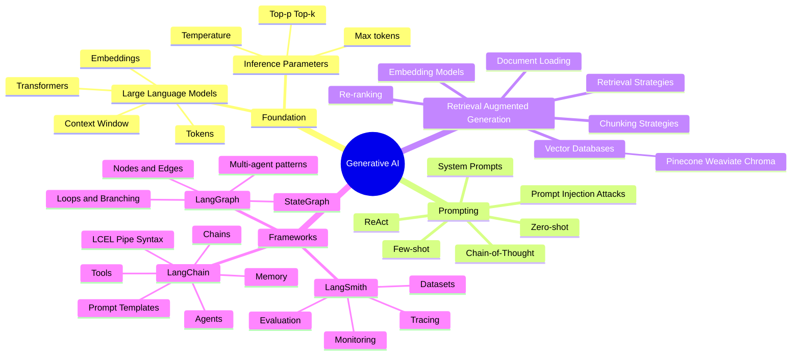

# Generative AI: Developer's Reference

From LLM fundamentals to production-grade AI systems. Built for interview prep and quick refreshers.

---

## What's Covered

| Topic | Key Concepts |
|-------|-------------|
| [LLM Fundamentals](llm-fundamentals.md) | Tokens, Context Window, Temperature, Embeddings, Hallucination |
| [Prompt Engineering](prompt-engineering.md) | Zero-shot, Few-shot, CoT, ReAct, System Prompts, Injection |
| [RAG](rag.md) | Indexing, Chunking, Vector DBs, Retrieval, Re-ranking |
| [LangChain](langchain.md) | LCEL, Prompt Templates, Chains, Memory, Tools, Agents |
| [LangGraph](langgraph.md) | StateGraph, Nodes, Edges, Loops, Supervisor Pattern |
| [LangSmith](langsmith.md) | Tracing, Evaluation, Datasets, Production Monitoring |

---

## The Modern AI Development Stack

```
┌──────────────────────────────────────────────────────────┐
│                   Your Application                        │
└──────────────────────┬───────────────────────────────────┘
                       │
┌──────────────────────▼───────────────────────────────────┐
│              Orchestration Layer                          │
│   LangChain (abstractions) + LangGraph (control flow)    │
└──────┬────────────────────────────┬──────────────────────┘
       │                            │
┌──────▼──────┐             ┌───────▼──────┐
│  LLM APIs   │             │  Knowledge   │
│  GPT-4      │             │  RAG + Vector│
│  Claude     │             │  Databases   │
│  Gemini     │             └──────────────┘
└─────────────┘
       │
┌──────▼──────────────────────────────────────────────────┐
│              Observability: LangSmith                    │
│         Traces, Evaluations, Datasets, Alerts            │
└─────────────────────────────────────────────────────────┘
```

---

## The Landscape Mindmap



---

## AI Development Shift

```
Old way:          Craft a prompt → call API → done

Modern way:       Design systems:
                    - How does the model access current information? (RAG)
                    - What tools can it call?              (Tool use)
                    - How does it handle multi-step tasks? (Agents)
                    - How do you debug when it's wrong?    (Observability)
                    - How do you know it's improving?      (Evaluation)
```

> **Simple one-shot LLM calls don't need a framework.** LangChain, LangGraph, and LangSmith earn their complexity when you're building pipelines, agents, and production systems that need to be debugged, evaluated, and maintained.
