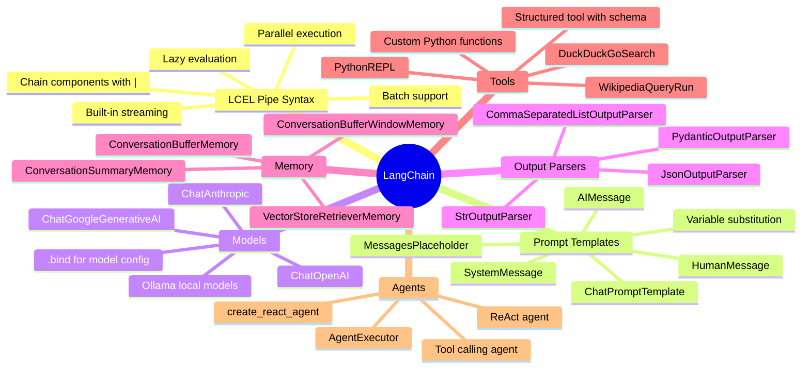

# LangChain

> **LangChain is a framework for building LLM-powered applications.** It provides composable building blocks — prompt templates, chains, memory, tools, and agents — and a unified interface to dozens of LLM providers.

---

## Why LangChain?

```
Without LangChain:                     With LangChain:
──────────────────────                 ─────────────────────
Manual prompt string formatting        ChatPromptTemplate with variables
Re-implement retry logic everywhere    Built-in retry / fallback
Custom parsing for each model output   Output parsers
Manual conversation history mgmt       Memory components
Custom tool execution scaffolding       Standardised tool + agent loop
No streaming abstraction               .stream() on any chain
```

> Use LangChain when you have complex pipelines. For a single API call with a simple prompt, the raw SDK is fine.

---

## Core Concepts Mindmap



---

## LCEL — LangChain Expression Language

> **LCEL is the modern way to compose LangChain.** Chains are built with the `|` (pipe) operator. Each component's output becomes the next component's input.

```python
from langchain_openai import ChatOpenAI
from langchain_core.prompts import ChatPromptTemplate
from langchain_core.output_parsers import StrOutputParser

llm = ChatOpenAI(model="gpt-4o", temperature=0)
parser = StrOutputParser()

prompt = ChatPromptTemplate.from_messages([
    ("system", "You are a concise technical assistant."),
    ("human", "{question}"),
])

# Build the chain with | operator
chain = prompt | llm | parser

# Invoke
result = chain.invoke({"question": "What is a context window?"})

# Stream token by token
for chunk in chain.stream({"question": "Explain embeddings"}):
    print(chunk, end="", flush=True)

# Batch multiple inputs
results = chain.batch([
    {"question": "What is RAG?"},
    {"question": "What is a vector database?"},
])
```

### LCEL Parallel Execution

```python
from langchain_core.runnables import RunnableParallel

# Run two chains simultaneously
parallel_chain = RunnableParallel({
    "summary":    summary_chain,
    "key_points": key_points_chain,
})

result = parallel_chain.invoke({"text": long_article})
# result = {"summary": "...", "key_points": [...]}
# Both chains ran at the same time ✅
```

---

## Prompt Templates

```python
from langchain_core.prompts import ChatPromptTemplate, MessagesPlaceholder
from langchain_core.messages import SystemMessage, HumanMessage

# Simple template with variable substitution
prompt = ChatPromptTemplate.from_messages([
    ("system", "You are a {role}. Answer in {language}."),
    ("human", "{question}"),
])

formatted = prompt.format_messages(
    role="senior DevOps engineer",
    language="simple English",
    question="What is Kubernetes?"
)

# Template with chat history (for conversational chains)
prompt_with_history = ChatPromptTemplate.from_messages([
    ("system", "You are a helpful assistant."),
    MessagesPlaceholder("chat_history"),   # ← injects history list here
    ("human", "{input}"),
])
```

---

## Memory

> Memory lets a chain "remember" previous turns in a conversation. Different types trade off between completeness and token efficiency.

```
ConversationBufferMemory
  Stores every message verbatim
  ✅ Perfectly accurate
  ❌ Grows unboundedly → hits context limit eventually
  Best for: short conversations

ConversationBufferWindowMemory(k=5)
  Keeps only the last k turns
  ✅ Bounded token usage
  ❌ Loses old context
  Best for: most chatbots

ConversationSummaryMemory
  Summarises older turns using an LLM
  ✅ Bounded + keeps gist of old context
  ❌ Extra LLM calls for summarisation
  Best for: long conversations where full history matters

ConversationSummaryBufferMemory(max_token_limit=2000)
  Keeps recent turns verbatim, summarises older ones
  ✅ Best of both worlds
  Best for: production chatbots
```

```python
from langchain.memory import ConversationBufferMemory
from langchain_core.runnables.history import RunnableWithMessageHistory

# Modern approach: RunnableWithMessageHistory
from langchain_community.chat_message_histories import ChatMessageHistory

store = {}  # session_id → ChatMessageHistory

def get_session_history(session_id: str) -> ChatMessageHistory:
    if session_id not in store:
        store[session_id] = ChatMessageHistory()
    return store[session_id]

chain_with_history = RunnableWithMessageHistory(
    chain,
    get_session_history,
    input_messages_key="input",
    history_messages_key="chat_history",
)

# Each call with same session_id shares history
chain_with_history.invoke(
    {"input": "What is LangChain?"},
    config={"configurable": {"session_id": "user-42"}}
)
```

---

## Tools

> **Tools give the LLM the ability to interact with the world** — search the web, run code, call APIs, query databases.

```python
from langchain_core.tools import tool
from pydantic import BaseModel

# Simple tool — decorate any function
@tool
def get_weather(city: str) -> str:
    """Get the current weather for a city."""
    # Call a real weather API here
    return f"Tokyo: 18°C, rainy"

# Tool with structured input schema
class StockInput(BaseModel):
    ticker: str
    date: str

@tool(args_schema=StockInput)
def get_stock_price(ticker: str, date: str) -> float:
    """Get the closing stock price for a ticker on a date."""
    return 182.50

# Bind tools to the LLM
llm_with_tools = ChatOpenAI(model="gpt-4o").bind_tools([get_weather, get_stock_price])
```

---

## Agents

> **Agents let the LLM decide which tools to use and in what order**, rather than following a fixed pipeline. The LLM is the decision-maker.

```python
from langchain import hub
from langchain.agents import create_react_agent, AgentExecutor
from langchain_community.tools import DuckDuckGoSearchRun, WikipediaQueryRun

tools = [
    DuckDuckGoSearchRun(),
    WikipediaQueryRun(),
    get_weather,
]

# Pull the ReAct prompt from LangChain Hub
react_prompt = hub.pull("hwchase17/react")

# Create agent (the reasoning loop)
agent = create_react_agent(llm, tools, react_prompt)

# Wrap in executor (handles the loop + error recovery)
agent_executor = AgentExecutor(
    agent=agent,
    tools=tools,
    verbose=True,          # Prints Thought/Action/Observation
    max_iterations=10,     # Prevent infinite loops
    handle_parsing_errors=True,
)

result = agent_executor.invoke({
    "input": "What's the weather in the capital of Japan?"
})
```

### What Happens Under the Hood

```
User: "What's the weather in the capital of Japan?"

Thought: I need to find the capital of Japan first.
Action: wikipedia_query("capital of Japan")
Observation: "Tokyo is the capital of Japan..."

Thought: Now I have the capital. I can check the weather.
Action: get_weather("Tokyo")
Observation: "Tokyo: 18°C, rainy"

Thought: I have all the info I need.
Final Answer: The capital of Japan is Tokyo, and the current weather is 18°C with rain.
```

---

## Output Parsers

```python
from langchain_core.output_parsers import (
    StrOutputParser,
    JsonOutputParser,
    CommaSeparatedListOutputParser,
)
from langchain_core.pydantic_v1 import BaseModel, Field

# String (default)
chain = prompt | llm | StrOutputParser()

# JSON — parse directly to dict
chain = prompt | llm | JsonOutputParser()

# Pydantic — typed, validated output
class Review(BaseModel):
    sentiment: str = Field(description="POSITIVE, NEGATIVE, or NEUTRAL")
    score: int = Field(description="Score from 1-10")
    summary: str = Field(description="One sentence summary")

parser = JsonOutputParser(pydantic_object=Review)
chain = prompt | llm | parser
result = chain.invoke({"review": "Great product, fast shipping!"})
# result is a typed Review object ✅
```

---

## Quick Reference

```
LCEL chain syntax:
  chain = prompt | llm | parser
  chain.invoke({})    → single result
  chain.stream({})    → token-by-token generator
  chain.batch([{}])   → list of results, parallel

Memory types by use case:
  Short chat    → ConversationBufferMemory
  Most chatbots → ConversationBufferWindowMemory(k=5)
  Long sessions → ConversationSummaryBufferMemory(max_token_limit=2000)

Agent components:
  Tools          → what the agent can do
  Prompt         → how the agent reasons (ReAct format)
  LLM            → what decides next action
  AgentExecutor  → runs the Thought→Action→Observation loop

Common chains:
  prompt | llm | parser              → basic chain
  retriever | format | prompt | llm  → RAG chain
  RunnableParallel({a: c1, b: c2})   → run two chains in parallel
```
