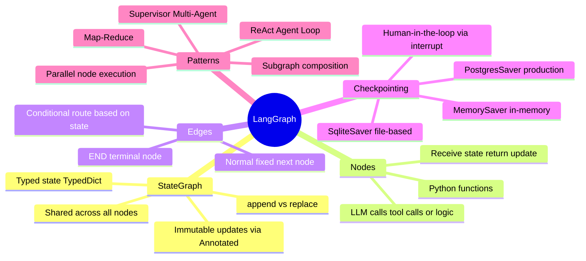

# LangGraph

> **LangGraph builds stateful, multi-step AI agents as graphs — not linear chains.** Nodes are functions, edges define what runs next, and a shared state object flows through the whole graph. This unlocks loops, branching, human-in-the-loop, and multi-agent patterns that LangChain's linear chains can't handle.

---

## Why LangGraph? The Linear Chain Problem

```
LangChain linear chain:
  Step1 → Step2 → Step3 → Done
  No loops. No branching. No "go back if this fails."

Real agent behaviour needs:
  - Loops: "keep searching until you find the answer"
  - Branching: "if the tool fails, try a different approach"
  - Conditionals: "if user approved, continue; else, ask again"
  - Parallel paths: "call two tools simultaneously"
  - Sub-agents: "delegate to a specialist agent"

LangGraph solves all of this with an explicit graph structure.
```

---

## Core Concepts Mindmap



---

## The State Object

> **State is the central data structure.** Every node receives the current state and returns updates to it. Nodes don't communicate with each other directly — only through state.

```python
from typing import TypedDict, Annotated
from operator import add

# Define what your agent tracks
class AgentState(TypedDict):
    # Messages: annotated with add → new messages APPEND to list
    messages: Annotated[list, add]

    # Simple fields: replaced each time a node updates them
    user_query: str
    retrieved_docs: list[str]
    final_answer: str
    retry_count: int
```

### `add` annotation vs regular field

```
messages: Annotated[list, add]
  → When a node returns {"messages": [new_msg]}
     it APPENDs to the existing list
  → History accumulates automatically

retrieved_docs: list[str]   (no annotation)
  → When a node returns {"retrieved_docs": [...]}
     it REPLACES the previous value entirely
```

---

## Building a Graph

```python
from langgraph.graph import StateGraph, END

def retrieve_node(state: AgentState) -> dict:
    """Fetch relevant documents."""
    docs = retriever.invoke(state["user_query"])
    return {"retrieved_docs": [d.page_content for d in docs]}

def generate_node(state: AgentState) -> dict:
    """Generate answer from docs."""
    context = "\n".join(state["retrieved_docs"])
    answer = llm.invoke(f"Context: {context}\nQuestion: {state['user_query']}")
    return {"messages": [answer], "final_answer": answer.content}

def should_retry(state: AgentState) -> str:
    """Conditional edge — decide next node."""
    if state["retry_count"] < 3 and not state["final_answer"]:
        return "retrieve"   # loop back
    return END              # done

# Build the graph
builder = StateGraph(AgentState)

# Add nodes
builder.add_node("retrieve", retrieve_node)
builder.add_node("generate", generate_node)

# Add edges
builder.set_entry_point("retrieve")           # where to start
builder.add_edge("retrieve", "generate")       # retrieve → generate (always)
builder.add_conditional_edges(                 # generate → ? (depends on state)
    "generate",
    should_retry,
    {"retrieve": "retrieve", END: END},        # map return value → node
)

# Compile
graph = builder.compile()

# Run
result = graph.invoke({"user_query": "How does RAG work?", "retry_count": 0})
```

---

## The ReAct Agent Loop

> The most common LangGraph pattern — implements the Thought → Action → Observation loop as a graph with a cycle.

```
                    ┌─────────────────┐
                    │   START         │
                    └────────┬────────┘
                             │
                    ┌────────▼────────┐
                    │  call_model     │  ← LLM decides: use tool? or answer?
                    │  (Thought step) │
                    └────────┬────────┘
                             │
               ┌─────────────▼─────────────┐
               │   should_continue?         │
               │   (conditional edge)       │
               └──────┬──────────┬──────────┘
                      │          │
              tool_call?       no tool call
                      │          │
            ┌─────────▼──┐    ┌──▼───────┐
            │  call_tools │    │   END    │
            │  (Action +  │    └──────────┘
            │  Observation│
            └─────────────┘
                      │
                      └──────────────▶ (back to call_model)
```

```python
from langgraph.prebuilt import create_react_agent

# LangGraph's built-in ReAct agent (handles the loop for you)
agent = create_react_agent(
    model=ChatOpenAI(model="gpt-4o"),
    tools=[search_tool, calculator_tool],
)

result = agent.invoke({
    "messages": [("human", "What is 15% of the population of Tokyo?")]
})
```

---

## Checkpointing & Human-in-the-Loop

> Checkpointing saves the graph state after each node. This enables:
> - **Persistence**: resume a conversation after the process restarts
> - **Human-in-the-loop**: pause, ask a human to review, then continue
> - **Time travel**: inspect and replay state from any previous checkpoint

```python
from langgraph.checkpoint.memory import MemorySaver
from langgraph.checkpoint.sqlite import SqliteSaver  # production-safe

# Add checkpointer at compile time
memory = MemorySaver()
graph = builder.compile(checkpointer=memory)

# Thread ID scopes the conversation (like session ID)
config = {"configurable": {"thread_id": "user-42-session-1"}}

# First invocation
graph.invoke({"messages": [("human", "Hi!")]}, config=config)

# Second invocation — graph remembers previous messages automatically
graph.invoke({"messages": [("human", "What did I just say?")]}, config=config)

# Human-in-the-loop: compile with interrupt_before
graph = builder.compile(
    checkpointer=memory,
    interrupt_before=["sensitive_action_node"],  # pause before this node
)

graph.invoke(input, config)
# Graph pauses at sensitive_action_node
# Human reviews state...
state = graph.get_state(config)
print(state.values)  # inspect current state

# Resume (optionally update state first)
graph.invoke(None, config)  # None = "continue from where you left off"
```

---

## Multi-Agent Patterns

### Supervisor Pattern

```
                    ┌──────────────────┐
    User ──────────▶│   Supervisor LLM │
                    │  (decides which  │
                    │   agent to call) │
                    └────────┬─────────┘
             ┌───────────────┼────────────────┐
             ▼               ▼                ▼
      ┌──────────┐   ┌──────────────┐   ┌──────────────┐
      │  Search  │   │ Code Writer  │   │  Data Analyst│
      │  Agent   │   │   Agent      │   │    Agent     │
      └──────────┘   └──────────────┘   └──────────────┘
             │               │                │
             └───────────────┴────────────────┘
                             │
                    ┌────────▼────────┐
                    │   Supervisor    │
                    │   (aggregate +  │
                    │    respond)     │
                    └─────────────────┘
```

```python
from langgraph.graph import StateGraph
from langchain_core.messages import HumanMessage

# Each agent is itself a compiled graph (subgraph)
search_agent = create_react_agent(llm, [search_tool])
code_agent   = create_react_agent(llm, [python_repl_tool])

def supervisor_node(state):
    # Supervisor LLM decides: which agent to delegate to?
    decision = supervisor_llm.invoke(state["messages"])
    return {"next_agent": decision.next}   # "search", "code", or "FINISH"

def route(state) -> str:
    return state["next_agent"]

builder = StateGraph(SupervisorState)
builder.add_node("supervisor", supervisor_node)
builder.add_node("search",     search_agent)
builder.add_node("code",       code_agent)

builder.set_entry_point("supervisor")
builder.add_conditional_edges("supervisor", route,
    {"search": "search", "code": "code", "FINISH": END})
builder.add_edge("search", "supervisor")  # always report back
builder.add_edge("code",   "supervisor")
```

---

## LangGraph vs LangChain Chains

```
┌─────────────────────┬──────────────────────┬────────────────────────────┐
│ Feature             │ LangChain Chain       │ LangGraph                  │
├─────────────────────┼──────────────────────┼────────────────────────────┤
│ Execution flow      │ Linear (A→B→C)        │ Graph (any topology)       │
│ Loops               │ ❌                    │ ✅                         │
│ Branching           │ Limited via routers   │ ✅ Conditional edges       │
│ State management    │ Manual                │ ✅ Typed state object       │
│ Human-in-the-loop   │ ❌                    │ ✅ interrupt_before/after  │
│ Checkpointing       │ ❌                    │ ✅ Built-in                 │
│ Multi-agent         │ ❌                    │ ✅ Subgraphs + supervisor   │
│ Debugging           │ Callbacks             │ ✅ LangSmith integration    │
│ Complexity          │ Low                   │ Higher                     │
│ Best for            │ Simple pipelines      │ Agents, complex workflows  │
└─────────────────────┴──────────────────────┴────────────────────────────┘
```

---

## Quick Reference

```
Key imports:
  from langgraph.graph import StateGraph, END
  from langgraph.prebuilt import create_react_agent
  from langgraph.checkpoint.memory import MemorySaver

State:
  TypedDict with Annotated[list, add] for accumulating lists
  Regular fields get replaced, annotated fields get merged

Graph building:
  builder = StateGraph(MyState)
  builder.add_node("name", function)
  builder.set_entry_point("name")
  builder.add_edge("a", "b")                         # fixed edge
  builder.add_conditional_edges("a", router_fn, map) # conditional edge
  graph = builder.compile(checkpointer=MemorySaver())

Running:
  graph.invoke(input, config={"configurable": {"thread_id": "abc"}})
  graph.stream(input, config=...)        # yields state after each node
  graph.get_state(config)                # inspect current checkpoint
```
