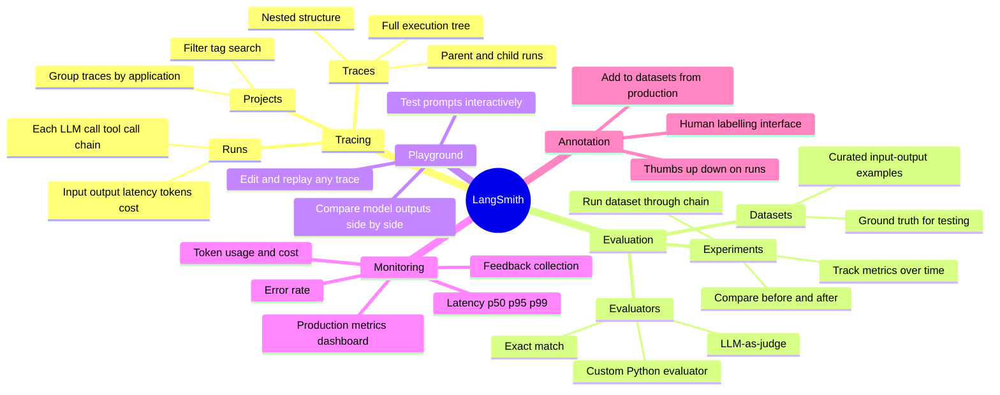

# LangSmith

> **LangSmith is the observability and evaluation layer for LLM applications.** When your AI system gives a wrong answer or behaves unexpectedly, LangSmith tells you exactly why — which step failed, what the model saw, what it returned.

---

## The Problem LangSmith Solves

```
Traditional debugging:
  Function fails → check the stack trace → fix the bug

LLM system "fails":
  User says "the answer was wrong"
  You have no idea why. Was it:
    - The wrong chunks retrieved from the vector store?
    - The LLM ignored the context?
    - The prompt was ambiguous?
    - The output parser failed?
    - A tool returned bad data?

Without observability: you're guessing.
With LangSmith: you see every step, every input, every output.
```

---

## Core Concepts Mindmap



---

## Setup (One-Time)

```python
import os

# Set these environment variables
os.environ["LANGCHAIN_TRACING_V2"] = "true"
os.environ["LANGCHAIN_API_KEY"]    = "ls__your_api_key"
os.environ["LANGCHAIN_PROJECT"]    = "my-rag-app"  # groups traces in UI

# That's it. LangChain + LangGraph automatically send traces.
# No code changes to your chains required.

# Or use the context manager for selective tracing:
from langsmith import traceable

@traceable(name="my_custom_function")
def process_document(doc: str) -> str:
    # This function call will appear in LangSmith traces
    return llm.invoke(f"Summarise: {doc}")
```

---

## Traces & Runs

> A **trace** is the full execution record of one user request — the entire tree of calls.
> A **run** is a single node in that tree (one LLM call, one tool call, one chain step).

```
Trace: "User asked: What is RAG?"
  │
  ├── Run: RAGChain (chain)                    [200ms total]
  │     │
  │     ├── Run: Retriever (retriever)         [45ms]
  │     │     └── Inputs:  "What is RAG?"
  │     │         Outputs: [chunk1, chunk2, chunk3]
  │     │
  │     ├── Run: ChatOpenAI (llm)              [140ms]
  │     │     └── Inputs:  [system_msg, context, question]
  │     │         Outputs: "RAG stands for Retrieval-Augmented..."
  │     │         Tokens:  prompt=842, completion=156, total=998
  │     │
  │     └── Run: StrOutputParser (parser)      [<1ms]
  │           └── Outputs: "RAG stands for Retrieval-Augmented..."
```

In the LangSmith UI, you can click into any run and see the exact prompt the model received — formatted with all variables substituted. This is invaluable for debugging prompt issues.

---

## Datasets & Evaluation

> Datasets are ground-truth input/output pairs. You run your chain against them and measure how well it performs — before and after changes.

### Creating a Dataset

```python
from langsmith import Client

client = Client()

# Create dataset
dataset = client.create_dataset(
    dataset_name="RAG Q&A Eval",
    description="Test cases for our documentation RAG system"
)

# Add examples (input + expected output)
client.create_examples(
    inputs=[
        {"question": "What is RAG?"},
        {"question": "How does chunking work?"},
        {"question": "What is cosine similarity?"},
    ],
    outputs=[
        {"answer": "RAG stands for Retrieval-Augmented Generation..."},
        {"answer": "Chunking splits documents into smaller pieces..."},
        {"answer": "Cosine similarity measures the angle between two vectors..."},
    ],
    dataset_id=dataset.id
)
```

### Running an Evaluation Experiment

```python
from langsmith.evaluation import evaluate, LangChainStringEvaluator

# Define your chain to evaluate
def rag_chain(inputs: dict) -> dict:
    answer = my_rag_chain.invoke(inputs["question"])
    return {"answer": answer}

# Choose evaluators
evaluators = [
    LangChainStringEvaluator("qa"),                    # LLM judges correctness
    LangChainStringEvaluator("cot_qa"),                # CoT reasoning before judging
    LangChainStringEvaluator("criteria",               # Custom criteria
        config={"criteria": "Is the answer concise and factual?"}),
]

# Run evaluation
results = evaluate(
    rag_chain,
    data="RAG Q&A Eval",         # dataset name
    evaluators=evaluators,
    experiment_prefix="v2-hybrid-retrieval",  # label for this run
)
```

### Evaluator Types

| Evaluator | How it works | Good for |
|-----------|-------------|----------|
| **Exact match** | String equality | Structured output, classification |
| **QA evaluator** | LLM grades answer vs reference | Open-ended Q&A |
| **CoT QA** | LLM reasons step-by-step before grading | Complex answers |
| **Criteria** | LLM judges against custom rubric | Tone, conciseness, factuality |
| **Custom Python** | Your own scoring function | Domain-specific metrics |

---

## Comparing Experiments

```
Experiment A: v1-basic-retrieval    → QA score: 0.72, latency: 320ms
Experiment B: v2-hybrid-retrieval   → QA score: 0.89, latency: 380ms  ← winner on quality
Experiment C: v3-reranking          → QA score: 0.91, latency: 520ms

LangSmith shows these side-by-side in a table:
  Which examples improved? Which regressed? Where is it still failing?
```

---

## Production Monitoring

```
Metrics available in LangSmith dashboard:

Latency:
  p50 (median), p95, p99 response times
  Breakdown by step (retrieval vs LLM vs parsing)

Cost:
  Token usage per run, per project
  Cost estimates by model

Quality:
  User feedback (thumbs up/down)
  Evaluator scores from online evaluation

Errors:
  Error rate over time
  Stack traces for failed runs
  Which inputs tend to cause failures
```

### Collecting User Feedback

```python
from langsmith import Client

client = Client()

# Log feedback after user rates the answer
client.create_feedback(
    run_id=run.id,           # ID from the trace
    key="user_rating",
    score=1,                 # 1 = positive, 0 = negative
    comment="This answer was very helpful!"
)

# View in LangSmith → filter runs by feedback score
# Low-rated runs → add to dataset → improve the system
```

---

## The Flywheel: Production → Dataset → Improvement

```
┌─────────────────────────────────────────────────────────────┐
│                    The Improvement Loop                      │
│                                                             │
│  Production traces ──▶ Review bad answers ──▶ Add to dataset│
│         ▲                                           │        │
│         │                                           ▼        │
│  Deploy improved chain ◀── Evaluate experiment ◀── Fix chain│
└─────────────────────────────────────────────────────────────┘
```

1. Users interact with your app → traces captured in LangSmith
2. Review traces with low ratings or wrong answers
3. Add those cases to your evaluation dataset
4. Improve your chain (better prompt, better retrieval, etc.)
5. Run the dataset through the new chain → compare experiment scores
6. Deploy the improved version
7. Repeat

---

## LangSmith vs Alternatives

```
┌─────────────────┬───────────────────┬────────────────────────────────────┐
│ Tool            │ Type              │ Notes                              │
├─────────────────┼───────────────────┼────────────────────────────────────┤
│ LangSmith       │ Full platform     │ Native LangChain integration       │
│ Langfuse        │ Open-source       │ Self-hostable, LangChain support   │
│ Weights&Biases  │ ML experiment mgmt│ Great if already using W&B         │
│ Helicone        │ LLM proxy         │ Lightweight, any LLM client        │
│ Arize Phoenix   │ Open-source       │ Strong on evaluation, local-first  │
└─────────────────┴───────────────────┴────────────────────────────────────┘
```

---

## Quick Reference

```
Setup:
  LANGCHAIN_TRACING_V2=true
  LANGCHAIN_API_KEY=ls__...
  LANGCHAIN_PROJECT=my-project
  → All LangChain/LangGraph calls auto-traced

Key URLs in LangSmith:
  /projects         → list of projects (each is an app/env)
  /projects/<id>    → traces for that project
  /datasets         → your evaluation datasets
  /experiments      → evaluation run results

Evaluation workflow:
  1. Create dataset (curated Q&A pairs)
  2. evaluate(chain, data="dataset", evaluators=[...])
  3. Compare experiments side-by-side
  4. Fix what's failing, repeat

Production loop:
  Bad trace → add to dataset → improve chain → run experiment → deploy
```
