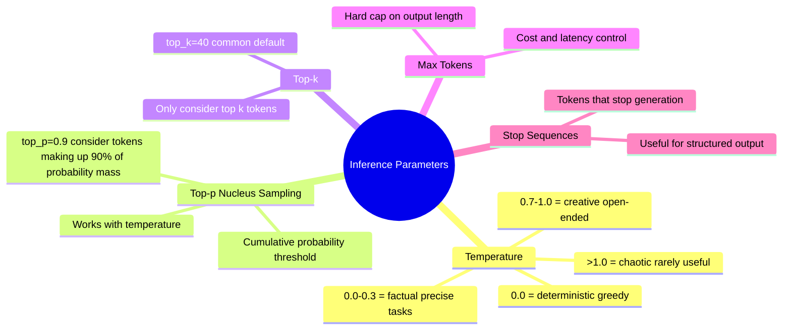

# LLM Fundamentals

> **Large Language Models are next-token predictors trained on massive text corpora.** Everything else — reasoning, coding, conversation — is an emergent behaviour from learning to predict text well enough.

---

## How LLMs Work (The One-Paragraph Version)

```
Training:
  Billions of text documents → Transformer neural network
  Task: predict the next token given all previous tokens
  Trained on enough data → model learns grammar, facts, reasoning, code

Inference:
  You send a prompt (tokens in)
  Model predicts next token → appends it → predicts next → repeat
  Until it predicts a stop token or hits max_tokens
```

> LLMs don't "know" things the way a database does. They learn statistical associations. This is why they hallucinate — they predict a plausible-sounding next token, not necessarily a true one.

---

## Tokens

> **Everything is tokens.** Not words, not characters — tokens. Understanding tokens is critical for understanding costs, context limits, and model behaviour.

```
"Hello, world!"  →  ["Hello", ",", " world", "!"]  →  4 tokens

"ChatGPT"        →  ["Chat", "G", "PT"]             →  3 tokens

"The quick brown fox" → ["The", " quick", " brown", " fox"]  →  4 tokens

Rule of thumb:
  ~4 characters ≈ 1 token (English)
  ~0.75 words   ≈ 1 token (English)
  Non-English languages are often less efficient (more tokens per word)
  Code tends to tokenize efficiently
```

### Why Tokens Matter

| Impact | Details |
|--------|---------|
| **Cost** | APIs charge per token (input + output) |
| **Context window** | Max tokens the model can see at once |
| **Latency** | More output tokens = slower response |
| **Truncation** | Inputs exceeding context window are cut off |

---

## Context Window

> **The context window is the maximum number of tokens the model can "see" at once** — your prompt, any conversation history, retrieved documents, and the response all count against it.

```
┌──────────────────────────────────────────────────────────┐
│                    Context Window (128k tokens)           │
│  ┌──────────┬──────────────┬──────────────┬───────────┐  │
│  │  System  │  Conversation│  Retrieved   │  Output   │  │
│  │  Prompt  │  History     │  Documents   │  (grows)  │  │
│  │  ~500    │  ~10,000     │  ~30,000     │  ~2,000   │  │
│  └──────────┴──────────────┴──────────────┴───────────┘  │
└──────────────────────────────────────────────────────────┘
```

### Context Window by Model (approximate)

| Model | Context Window |
|-------|---------------|
| GPT-4o | 128k tokens |
| Claude 3.5 Sonnet | 200k tokens |
| Gemini 1.5 Pro | 1M tokens |
| Llama 3.1 70B | 128k tokens |
| GPT-3.5 Turbo | 16k tokens |

> Larger context ≠ always better. Models tend to lose focus on information in the **middle** of very long contexts ("lost in the middle" problem). Important info goes at the start or end.

---

## Inference Parameters



### Temperature Intuition

```
Temperature = 0.0 (deterministic):
  Prompt: "The capital of France is"
  Output: "Paris" (always, every time)

Temperature = 0.7 (balanced):
  Prompt: "Write me a product tagline for coffee"
  Output: varies each call, creative but coherent

Temperature = 1.5 (high):
  Output: creative, unexpected, sometimes incoherent

Use low temperature for:  factual Q&A, code generation, extraction
Use high temperature for: brainstorming, creative writing, variation
```

---

## Embeddings

> **An embedding is a numerical vector that captures semantic meaning.** Similar meanings → similar vectors (close in vector space).

```
"dog"    → [0.23, -0.87, 0.14, ...]  (1536 dimensions for ada-002)
"puppy"  → [0.25, -0.85, 0.16, ...]  (very close → similar meaning)
"cat"    → [0.18, -0.71, 0.22, ...]  (moderately close → related animal)
"SQL"    → [0.91,  0.12, -0.54, ...] (far away → different domain)
```

### Cosine Similarity

```
How close are two vectors?

cosine_similarity = (A · B) / (|A| × |B|)

Result: -1 (opposite) to 1 (identical)

"dog" vs "puppy"    → ~0.93  (very similar)
"dog" vs "cat"      → ~0.78  (related)
"dog" vs "database" → ~0.21  (unrelated)
```

### What Embeddings Enable

| Application | How |
|-------------|-----|
| **Semantic search** | Embed query, find nearest document embeddings |
| **RAG** | Store doc chunks as embeddings, retrieve relevant ones |
| **Clustering** | Group similar items by vector proximity |
| **Recommendation** | "Similar items" = nearby vectors |
| **Classification** | Train classifier on top of embeddings |

### Popular Embedding Models

| Model | Dimensions | Notes |
|-------|-----------|-------|
| `text-embedding-3-small` (OpenAI) | 1536 | Cheap, fast, very good |
| `text-embedding-3-large` (OpenAI) | 3072 | Better quality, more cost |
| `embed-english-v3.0` (Cohere) | 1024 | Strong for retrieval |
| `all-MiniLM-L6-v2` (HuggingFace) | 384 | Open-source, runs locally |

---

## Hallucination

> **Hallucination = the model confidently generates false information.** It's not lying — it's pattern-matching gone wrong. The model predicts plausible-sounding tokens, not necessarily true ones.

```
Types of hallucination:
  Factual:    "The Eiffel Tower was built in 1902" (wrong: 1889)
  Citation:   Made-up paper titles, non-existent URLs
  Entity:     Real person attributed a quote they never said
  Reasoning:  Confidently wrong math or logic
```

### Why It Happens

```
Training data contains:
  - Errors and contradictions
  - Fictional content presented as fact
  - Out-of-date information

Inference:
  Model predicts next token based on patterns
  "Eiffel Tower built in ___" → "1889" (correct pattern)
  "The author of [obscure book] is ___" → plausible but wrong name
```

### Mitigation Strategies

| Strategy | How it helps |
|----------|-------------|
| **RAG** | Ground answers in retrieved real documents |
| **Grounding instructions** | "Only use information from the provided context" |
| **Low temperature** | Less random → more likely to reproduce training facts |
| **Self-consistency** | Sample multiple times, take majority vote |
| **Citation requirements** | Prompt model to cite sources, easier to verify |
| **Structured output** | Constrain format → harder to invent |

---

## Major Model Families

```
┌─────────────────────┬──────────────┬────────────┬────────────────────────────┐
│ Family              │ Maker        │ Access     │ Strengths                  │
├─────────────────────┼──────────────┼────────────┼────────────────────────────┤
│ GPT-4o / o3         │ OpenAI       │ API        │ General purpose, tool use  │
│ Claude 3.5 / 4      │ Anthropic    │ API        │ Long context, coding, safe │
│ Gemini 1.5 Pro      │ Google       │ API        │ Multimodal, huge context   │
│ Llama 3.x           │ Meta         │ Open       │ Runs locally, no API cost  │
│ Mistral             │ Mistral AI   │ Open + API │ Efficient, multilingual    │
│ Qwen 2.5            │ Alibaba      │ Open       │ Coding, multilingual       │
└─────────────────────┴──────────────┴────────────┴────────────────────────────┘
```

---

## Quick Reference

```
Tokens:
  ~4 chars ≈ 1 token (English)
  Cost and context limits are measured in tokens

Context Window:
  Everything the model can see: system prompt + history + docs + response
  "Lost in the middle" — critical info at start or end

Temperature:
  0 = deterministic (facts, code)
  0.7 = balanced (most tasks)
  1.0+ = creative (brainstorming)

Embeddings:
  Vectors that capture semantic meaning
  Similar meaning = similar vector = small cosine distance
  Power semantic search and RAG

Hallucination:
  Model predicts plausible, not necessarily true
  Mitigate with RAG, grounding, low temperature
```
