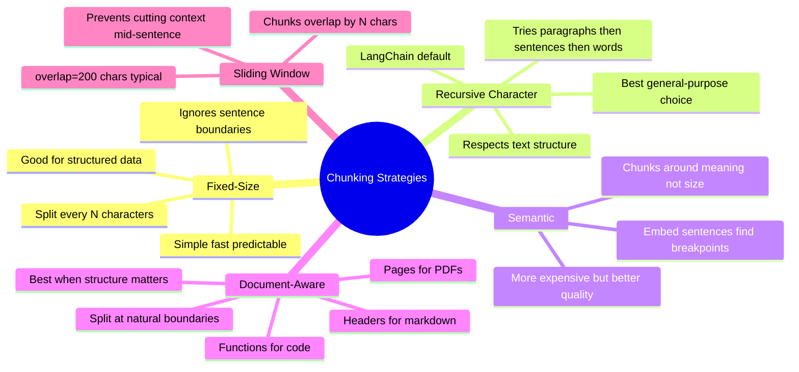
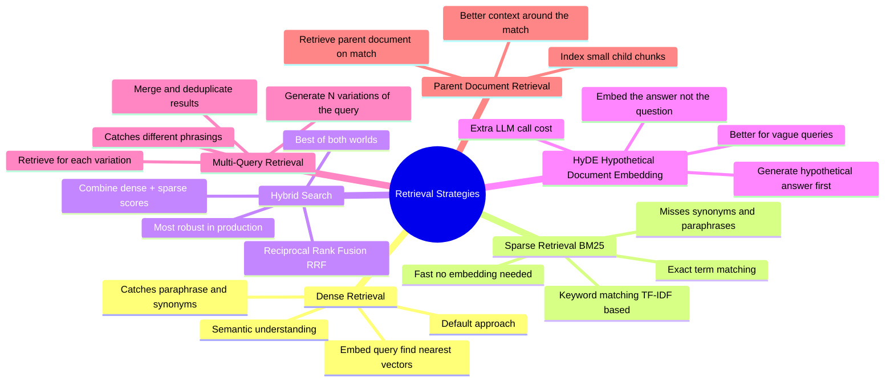

# RAG — Retrieval-Augmented Generation

> **RAG grounds LLM responses in external, up-to-date knowledge.** Instead of relying solely on what the model learned during training, you retrieve relevant documents at query time and feed them into the prompt.

---

## The Problem RAG Solves

```
LLM without RAG:
  ❌ Knowledge cutoff — doesn't know about recent events
  ❌ No access to your private data (company docs, internal wikis)
  ❌ Hallucination — invents facts when it doesn't know something
  ❌ Can't cite sources (there are none)

LLM with RAG:
  ✅ Grounded in real, retrieved documents
  ✅ Can work with your private, up-to-date data
  ✅ Can cite the source documents it used
  ✅ Hallucination drops dramatically when grounded
```

---

## RAG Architecture Overview

```
               ┌─────────────────────────────────────────────┐
               │             INDEXING PIPELINE                │
               │   (done once, or on document updates)        │
               │                                              │
               │  Documents → Chunk → Embed → Vector Store   │
               └─────────────────────────────────────────────┘

                         ┌──────────────────┐
                         │   Vector Store   │
                         │ (Pinecone/Chroma) │
                         └────────┬─────────┘
                                  │
               ┌─────────────────────────────────────────────┐
               │             RETRIEVAL PIPELINE               │
               │   (runs on every user query)                 │
               │                                              │
  User Query ──▶ Embed Query ──▶ Similarity Search ──▶ Top-K │
               │       Chunks                                 │
               └──────────────────────┬──────────────────────┘
                                      │
                         ┌────────────▼────────────┐
                         │  Prompt: Context + Query │
                         │  [chunk1][chunk2][chunk3] │
                         │  "Answer based on above:" │
                         └────────────┬─────────────┘
                                      │
                              ┌───────▼───────┐
                              │      LLM      │
                              └───────┬───────┘
                                      │
                             Grounded Answer
                             + Source Citations
```

---

## Step 1: Document Loading

> Get your data into a usable format. Different sources need different loaders.

```python
from langchain_community.document_loaders import (
    PyPDFLoader,          # PDF files
    WebBaseLoader,        # Web pages
    TextLoader,           # Plain text
    CSVLoader,            # CSV files
    NotionDBLoader,       # Notion databases
    GitLoader,            # Code repositories
)

loader = PyPDFLoader("company_handbook.pdf")
docs = loader.load()  # List[Document] with page_content + metadata
```

---

## Step 2: Chunking Strategies

> **Chunking is critical.** Too large = diluted retrieval, too small = missing context. The right strategy depends on your document type.



### Chunk Size Trade-offs

```
Small chunks (~200 tokens):
  ✅ Precise retrieval — return exactly what was asked
  ❌ May lose surrounding context needed for the answer
  Best for: FAQs, fact lookup

Large chunks (~800 tokens):
  ✅ Rich context — answer fits within the chunk
  ❌ Retrieval is noisier — includes irrelevant content too
  Best for: long-form documents, conceptual explanations

Overlap (~10-20% of chunk size):
  Chunks share N tokens with next chunk
  Prevents answers being split at a boundary
```

```python
from langchain.text_splitter import RecursiveCharacterTextSplitter

splitter = RecursiveCharacterTextSplitter(
    chunk_size=500,        # Target token count per chunk
    chunk_overlap=50,      # Shared tokens between adjacent chunks
    separators=["\n\n", "\n", " ", ""],  # Try these in order
)
chunks = splitter.split_documents(docs)
```

---

## Step 3: Embedding & Storing

```python
from langchain_openai import OpenAIEmbeddings
from langchain_community.vectorstores import Chroma

embeddings = OpenAIEmbeddings(model="text-embedding-3-small")

# Embed chunks and store in vector DB (one-time setup)
vectorstore = Chroma.from_documents(
    documents=chunks,
    embedding=embeddings,
    persist_directory="./chroma_db"
)
```

---

## Vector Databases

```
┌──────────────────┬─────────────┬────────────────────────────────────────┐
│ Database         │ Type        │ Notes                                  │
├──────────────────┼─────────────┼────────────────────────────────────────┤
│ Pinecone         │ Managed     │ Fully hosted, production-grade, fast   │
│ Weaviate         │ Self/Managed│ GraphQL API, multi-modal support       │
│ Chroma           │ Open-source │ Easiest for local dev + prototyping    │
│ Qdrant           │ Open-source │ Rust-based, fast, rich filtering       │
│ pgvector         │ Extension   │ Vector search inside PostgreSQL        │
│ Redis (RediSearch)│ In-memory  │ Low-latency, existing Redis infra      │
│ FAISS            │ Library     │ Meta's library, in-memory, no server   │
└──────────────────┴─────────────┴────────────────────────────────────────┘
```

**pgvector** is worth highlighting — it adds vector search to PostgreSQL, letting you keep everything in one database without a separate vector store service.

```sql
-- pgvector example
CREATE EXTENSION vector;
CREATE TABLE documents (
    id SERIAL PRIMARY KEY,
    content TEXT,
    embedding vector(1536)
);

-- Semantic similarity search
SELECT content, embedding <-> '[0.1, 0.2, ...]' AS distance
FROM documents
ORDER BY distance
LIMIT 5;
```

---

## Step 4: Retrieval Strategies



### Hybrid Search (Most Robust)

```
Query: "how to handle auth errors"

Dense retrieval finds:
  - "authentication failure handling" (semantic match)
  - "token expiry management" (related concept)

BM25 (sparse) finds:
  - "catch auth errors in middleware" (keyword match)
  - "error codes for auth" (exact terms)

Combined → better coverage than either alone
RRF score = Σ 1/(k + rank_i)  where k=60 is a constant
```

---

## Step 5: Context Stuffing & Re-ranking

### Context Stuffing

```python
# Basic RAG query
retriever = vectorstore.as_retriever(search_kwargs={"k": 5})

def rag_chain(question):
    docs = retriever.invoke(question)
    context = "\n\n".join(doc.page_content for doc in docs)

    prompt = f"""Answer based ONLY on the provided context.
If the answer isn't in the context, say "I don't have that information."

Context:
{context}

Question: {question}
Answer:"""

    return llm.invoke(prompt)
```

### Re-ranking (Cross-Encoder)

```
Problem: Vector similarity is fast but approximate.
         The top-5 retrieved chunks may not be the most relevant 5.

Re-ranking:
  1. Retrieve top-20 chunks (recall phase — cast wide net)
  2. Run a cross-encoder model on each chunk vs the query
     (more expensive but more accurate relevance scoring)
  3. Return top-5 after re-ranking

Result: Much better precision with reasonable latency cost.

Tools: Cohere Rerank API, cross-encoder/ms-marco-MiniLM (HuggingFace)
```

---

## RAG vs Fine-tuning

```
┌───────────────────┬──────────────────────────┬──────────────────────────┐
│                   │ RAG                      │ Fine-tuning              │
├───────────────────┼──────────────────────────┼──────────────────────────┤
│ Knowledge update  │ Easy — add docs to store │ Re-train required        │
│ Private data      │ ✅ At retrieval time      │ ✅ Baked into weights    │
│ Up-to-date info   │ ✅ Always current         │ ❌ Frozen at train time  │
│ Source citation   │ ✅ Natural                │ ❌ Hard                  │
│ Cost              │ Retrieval + inference     │ Training + inference     │
│ Hallucination     │ Low (grounded)            │ Lower than base model    │
│ Best for          │ Dynamic knowledge bases  │ Style/format/behaviour   │
│                   │ Private docs, Q&A        │ Domain language patterns │
└───────────────────┴──────────────────────────┴──────────────────────────┘

Key insight: Use RAG for "what does the model know?"
             Use fine-tuning for "how does the model respond?"
             They're complementary — you can do both.
```

---

## RAG Failure Modes & Fixes

| Problem | Symptom | Fix |
|---------|---------|-----|
| **Wrong chunks retrieved** | Answer is off-topic | Better chunking, hybrid search, re-ranking |
| **Answer not in chunks** | "I don't have that information" when doc exists | Increase `k`, fix chunking boundaries |
| **Context too long** | Model ignores middle of context | Rerank to put most relevant chunks first/last |
| **Stale embeddings** | Old answers after document update | Re-index updated documents |
| **Semantic drift** | Query phrasing differs from doc phrasing | HyDE, multi-query retrieval, hybrid search |
| **Injection via docs** | Retrieved content manipulates the model | Sanitize retrieved content, treat as untrusted |

---

## Evaluation Metrics

```
Retrieval quality:
  Precision@K  → Of the K chunks retrieved, how many are relevant?
  Recall@K     → Of all relevant chunks, how many did we retrieve?
  MRR          → Mean Reciprocal Rank — how high is the first relevant result?

Answer quality (RAGAS framework):
  Faithfulness     → Is the answer grounded in the retrieved context? (no hallucination)
  Answer relevance → Does the answer actually address the question?
  Context recall   → Does the context contain what's needed to answer?
  Context precision → Are the retrieved chunks actually useful?
```
