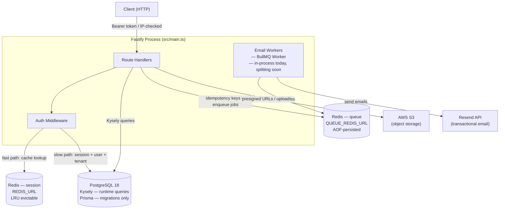
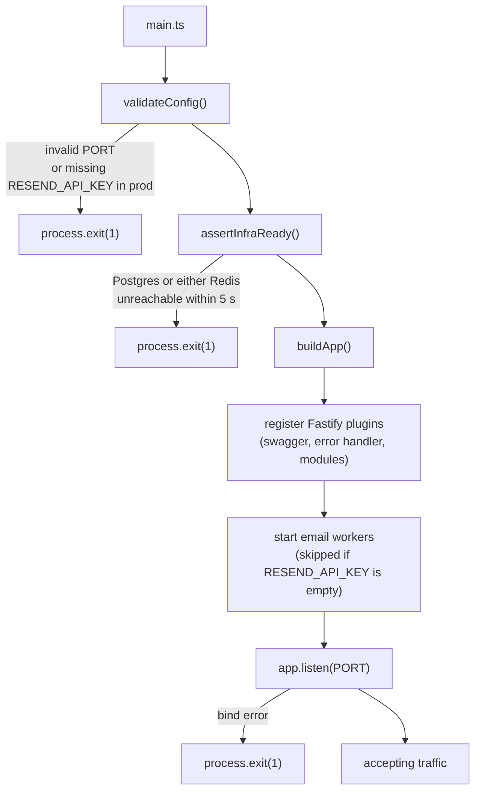
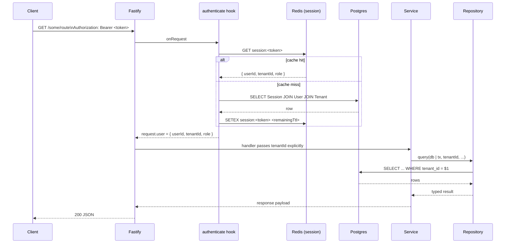
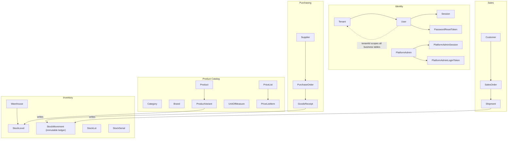

# Architecture

> Return here first when re-entering the codebase cold. For deep rationale on any decision, see `docs/engineering-charter.md` or the relevant ADR in `docs/adr/`.

## System Components

**Two Redis instances are intentional** — session cache (`REDIS_URL`) can be LRU-evicted without data loss; a lost session is just a logout. Queue Redis (`QUEUE_REDIS_URL`) must be AOF-persisted because losing it loses enqueued jobs.

**Email workers** currently start inside the same process as the HTTP server (via `startEmailWorkers()` in `buildApp()`). They will move to a dedicated worker process; when that happens, both processes connect to `QUEUE_REDIS_URL` independently.

---

## Startup Sequence

Nothing degrades silently — any failure before `app.listen` exits the process immediately.

---

## Request Lifecycle

### Tenant route (any route outside `/platform/*`)

### Platform route (`/platform/*`)

Platform routes go through a separate middleware chain:

1. **IP allowlist check** — request IP must be in `PLATFORM_IP_ALLOWLIST`. Non-matching IPs receive `404` (not `403`) to avoid confirming the surface exists.
2. **`authenticate-platform` hook** — looks up `PlatformAdminSession` by SHA-256 token hash. No Redis cache — DB-only, so row deletion revokes instantly.
3. **No `tenantId`** — platform handlers are cross-tenant by design. All platform queries are unscoped.

---

## API Surfaces

| Surface | Prefix | Auth | Who |
|---|---|---|---|
| Tenant API | `/*` (everything else) | Bearer opaque token → `Session` table | Tenant users |
| Platform API | `/platform/*` | IP allowlist + Bearer → `PlatformAdminSession` | Superadmins only |
| Swagger UI | `/platform/docs` | IP allowlist (same hook, 404 to non-listed) | Superadmins only |
| Bull Board | `/platform/queues` | IP allowlist (same hook, 404 to non-listed) | Superadmins only |
| Health | `/health` | None | Load balancer / monitoring |

`PLATFORM_IP_ALLOWLIST` is a comma-separated list of exact IPs and IPv4 CIDR ranges. Empty = fail-closed (deny all). See ADR 0002.

---

## Domain Model

Five bounded domains. Cross-domain relations flow through stable IDs — no FK constraints across domain boundaries.

**Key invariants:**
- `StockMovement` is an **immutable ledger** — never updated, never deleted. Corrections are offsetting rows. `StockLevel` is a materialized snapshot rebuildable by summing movements.
- `AuditLog` is also immutable — written in the same transaction as the change it records.
- `UnitOfMeasure` is the only global (non-tenant-scoped) business table. Every other business table carries `tenantId`.

For full column detail, see `prisma/schema.prisma`.

---

## Module Map

| Module / Directory | Owns |
|---|---|
| `src/main.ts` | Process entry point — startup sequence |
| `src/app.ts` | `buildApp()` — plugin registration, worker startup, graceful shutdown |
| `src/modules/auth/` | Tenant login, logout, password reset, session management |
| `src/modules/platform/` | Tenant provisioning, platform admin auth (magic-link), platform-scoped ops |
| `src/modules/users/` | Tenant user CRUD, role management, user welcome email |
| `src/modules/categories/` | Category tree (recursive), CRUD |
| `src/modules/products/` | Product + variant catalog, pricing, verification flow |
| `src/modules/health/` | `GET /health` — liveness probe |
| `src/shared/auth/` | Session lookup, IP allowlist, permissions, token hashing |
| `src/shared/db/` | Kysely instance (`AppDb`), Prisma owns migrations only |
| `src/shared/cache/` | ioredis client factory |
| `src/shared/queue/` | BullMQ connection factory, Bull Board plugin |
| `src/shared/audit/` | Tenant `AuditRepository`, platform `PlatformAuditRepository` |
| `src/shared/email/` | Resend client, HTML email templates |
| `src/shared/storage/` | S3 client, presigned URL helpers |
| `src/shared/idempotency/` | Idempotency key store (backed by queue Redis) |
| `src/shared/errors/` | Error base classes, Fastify error handler |
| `src/shared/config/` | Typed config object, `validateConfig()` |
| `src/shared/infra/` | `assertInfraReady()` — startup probes |
| `src/shared/logging/` | Pino logger instance |
| `src/workers/email.worker.ts` | BullMQ workers for all email queues |
| `src/scripts/` | CLI scripts for platform admin lifecycle (run outside HTTP server) |
| `src/types/` | Kysely `DB` type (codegen output), Fastify type augmentations |
