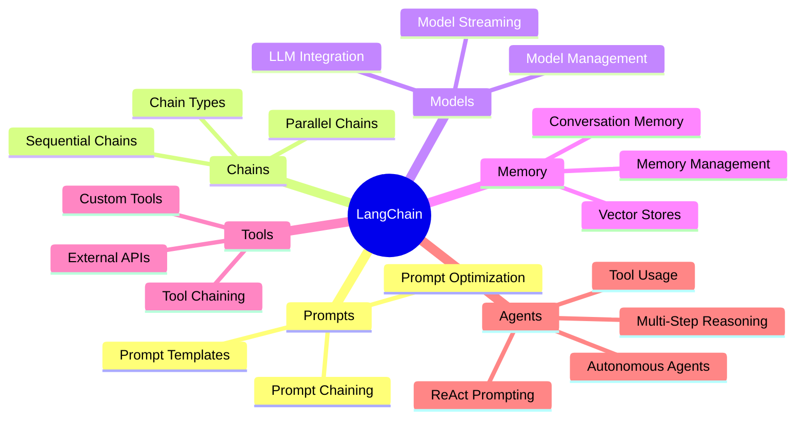
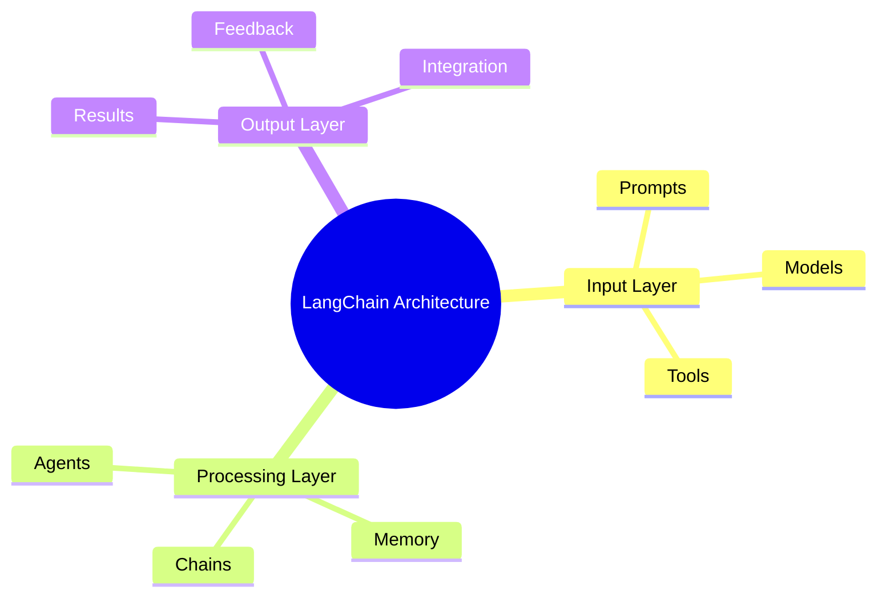
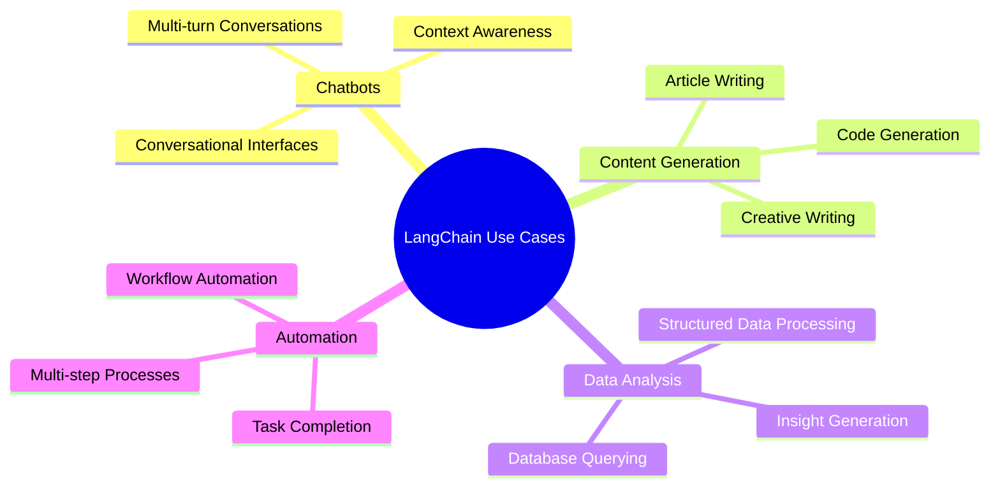
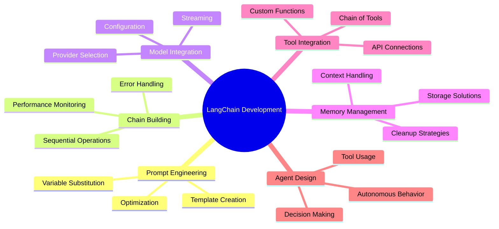

# LangChain: A Comprehensive Guide

## What is LangChain?

LangChain is a framework that enables developers to build applications powered by language models (LLMs). It provides a set of tools and abstractions that make it easier to integrate LLMs into applications, handle prompts, manage chains of operations, and work with various LLM providers.

## Core Components

### 1. Prompts
- **Prompt Templates**: Predefined structures for input to LLMs
- **Prompt Chaining**: Combining multiple prompts sequentially
- **Prompt Optimization**: Improving prompt effectiveness

### 2. Chains
- **Sequential Chains**: Series of operations that feed into each other
- **Parallel Chains**: Multiple operations running simultaneously
- **Chain Types**: LLMChain, StuffChain, MapReduceChain, etc.

### 3. Models
- **LLM Integration**: Connecting to various language models
- **Model Management**: Handling different model providers and configurations
- **Model Streaming**: Real-time response handling

### 4. Memory
- **Conversation Memory**: Storing and retrieving conversation history
- **Vector Stores**: Long-term memory using embedding databases
- **Memory Management**: Efficient handling of context and history

### 5. Tools
- **External APIs**: Integration with external services
- **Custom Tools**: Building specialized functions
- **Tool Chaining**: Combining multiple tools in workflows

## Key Features

### Prompt Engineering
- Template-based prompt creation
- Variable substitution in prompts
- Prompt optimization techniques
- Few-shot learning implementation

### Chain Management
- Sequential execution of operations
- Error handling in chains
- Chain composition and reusability
- Chain monitoring and debugging

### Agent Architecture
- **ReAct Prompting**: Reasoning and Action prompting
- **Tool Usage**: Agents that can call external tools
- **Multi-Step Reasoning**: Complex problem solving
- **Autonomous Agents**: Self-directed decision making

## Architecture Overview

```
┌─────────────────┐    ┌─────────────────┐    ┌─────────────────┐
│   Prompt        │    │   Chain         │    │   Model         │
│   Templates     │───▶│   Operations    │───▶│   Integration   │
└─────────────────┘    └─────────────────┘    └─────────────────┘
        │                       │                       │
        ▼                       ▼                       ▼
┌─────────────────┐    ┌─────────────────┐    ┌─────────────────┐
│   Memory        │    │   Tools         │    │   Agents        │
│   Management    │───▶│   Integration   │───▶│   Decision      │
└─────────────────┘    └─────────────────┘    └─────────────────┘
```

## Use Cases

### 1. Chatbots
- Conversational interfaces
- Context-aware responses
- Multi-turn conversations

### 2. Content Generation
- Article writing
- Code generation
- Creative writing

### 3. Data Analysis
- Querying databases
- Processing structured data
- Generating insights

### 4. Automation
- Workflow automation
- Task completion
- Multi-step processes

## Installation and Setup

```bash
pip install langchain
```

Basic setup:
```python
from langchain.llms import OpenAI
from langchain.chains import LLMChain
from langchain.prompts import PromptTemplate

llm = OpenAI(temperature=0.9)
prompt = PromptTemplate(
    input_variables=["product"],
    template="What is a good name for a company that makes {product}?",
)
chain = LLMChain(llm=llm, prompt=prompt)
result = chain.run("colorful socks")
```

## Best Practices

### Prompt Engineering
- Use clear, specific instructions
- Include examples when possible
- Test different prompt variations
- Monitor prompt performance

### Chain Design
- Keep chains simple and focused
- Handle errors gracefully
- Use appropriate chain types for tasks
- Monitor chain performance

### Memory Management
- Implement efficient memory strategies
- Balance context length and performance
- Clear memory appropriately
- Handle memory overflow scenarios

## Advanced Concepts

### Retrieval-Augmented Generation (RAG)
- Combining LLMs with external knowledge
- Document retrieval systems
- Context augmentation
- Information filtering

### Multi-LLM Workflows
- Switching between different models
- Model selection strategies
- Ensemble methods
- Hybrid approaches

### Custom Components
- Building custom chains
- Creating specialized tools
- Developing custom models
- Extending existing components

## Limitations and Considerations

### Technical Limitations
- Token limits and costs
- Model reliability and consistency
- Context window constraints
- Performance scalability

### Ethical Considerations
- Bias in language models
- Privacy and data handling
- Responsible AI practices
- Transparency in outputs

## Future Directions

- Improved model integration
- Better tool chaining capabilities
- Enhanced memory systems
- More sophisticated agent architectures
- Better performance optimization

---

## Mindmap: LangChain Core Components



## Mindmap: LangChain Architecture



## Mindmap: LangChain Use Cases



## Mindmap: LangChain Development Flow



## Quick Reference Guide

### Key Classes
- `LLMChain` - Main chain component
- `PromptTemplate` - Prompt creation
- `Memory` - Context storage
- `Tool` - External functionality
- `Agent` - Decision making

### Common Patterns
1. **Prompt → Chain → Model** workflow
2. **Memory** integration for context
3. **Tool** chaining for complex operations
4. **Agent** orchestration for decision making

### Performance Tips
- Optimize prompt templates
- Monitor token usage
- Implement proper error handling
- Use appropriate chain types
- Manage memory efficiently
