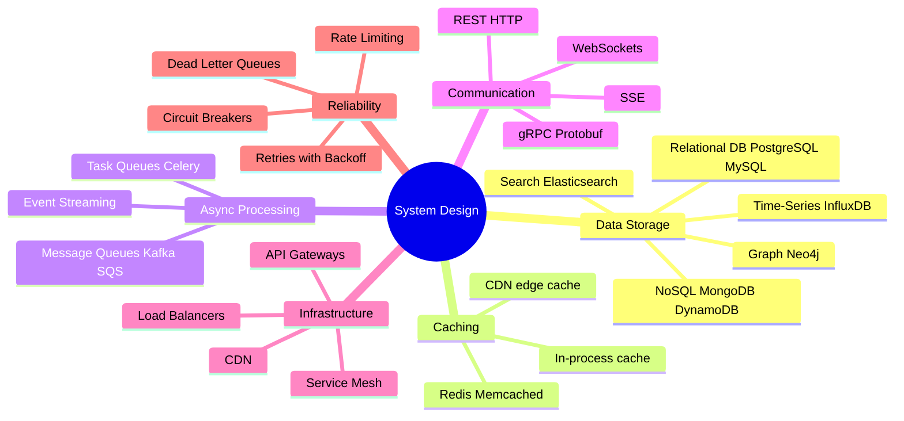

# System Design: Interview Prep Guide

Key system design building blocks — explained the way interviewers expect you to defend them.

---

## What's Covered

| Topic | Key Concepts |
|-------|-------------|
| [Message Queues](message-queues.md) | Producers, Consumers, ACKs, Delivery Guarantees, Partitioning, Backpressure, DLQ, Kafka, SQS, RabbitMQ |

---

## The System Design Interview Mindset

```
Interviewers aren't just checking if you know the technology.
They want to see:

  1. You can identify WHY a component is needed (motivating problem)
  2. You know HOW it works under the hood (not just "use Kafka")
  3. You can reason about trade-offs (ordering vs throughput)
  4. You've thought about failure modes (what happens when X breaks?)
  5. You know when NOT to use something
```

---

## Common System Design Components (Mindmap)



---

> **Interview tip:** When you draw a component on the whiteboard, be ready to go one level deeper on any of it. If you write "Kafka" — know partitions, consumer groups, delivery guarantees, and when you'd use SQS instead.
