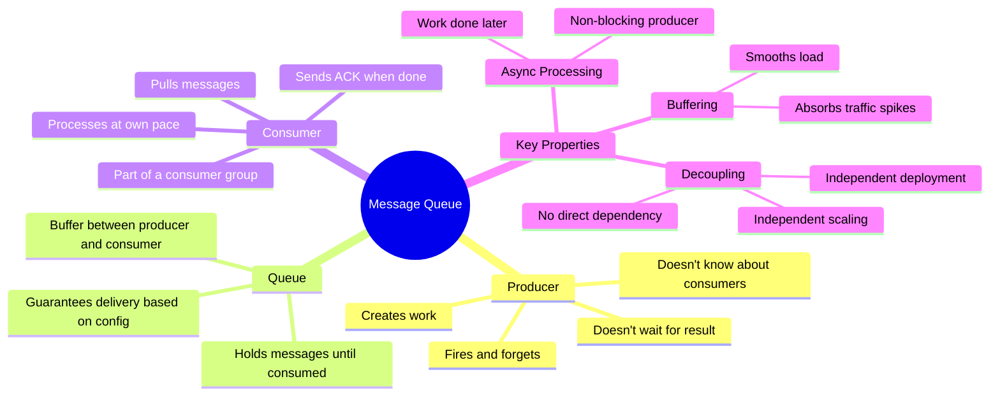
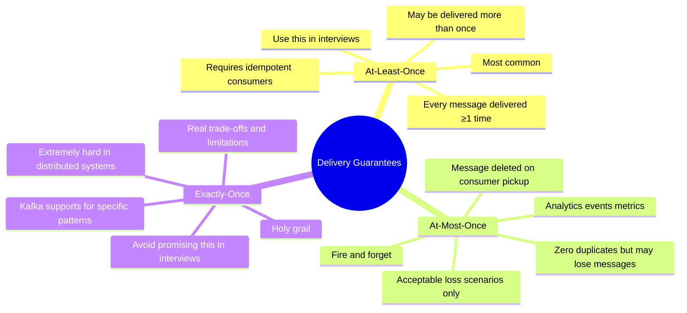
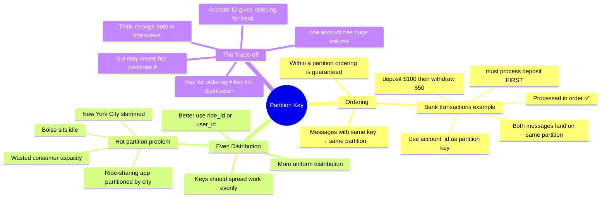
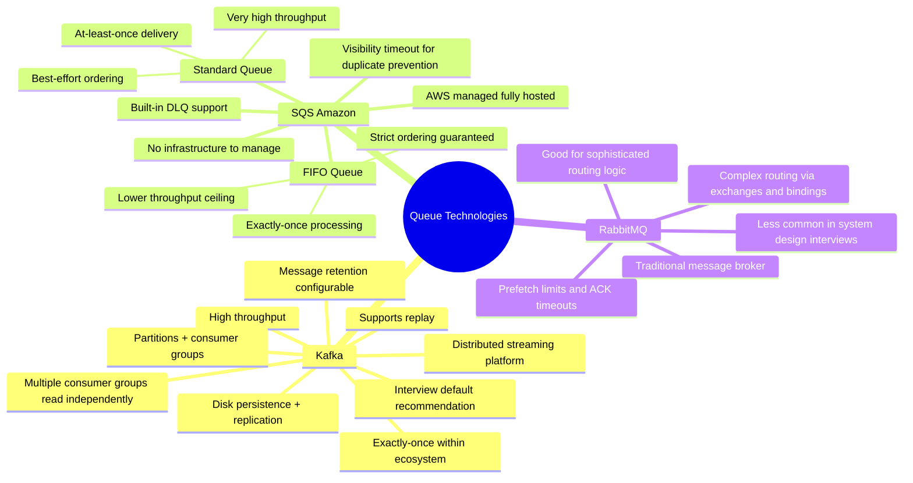

# Message Queues

> **A message queue is a buffer that decouples the service that creates work (producer) from the service that does the work (consumer).** It lets each side operate independently, at its own pace, without knowing about the other.

---

## The Motivating Problem

Imagine you're building a photo-sharing app like Instagram. When a user uploads a photo, you need to:

- Resize it into multiple resolutions
- Apply filters
- Run content moderation checks

Each step takes a couple of seconds.

### The Naive Architecture (Synchronous)

```
Client
  │
  ▼ upload photo
Server
  ├── resize image       (2s)
  ├── apply filters      (2s)
  └── run moderation     (2s)
  │
  ▼ "Upload complete!" (after 6 seconds)
Client
```

**Three real problems:**

| Problem | What Goes Wrong |
|---------|----------------|
| **Latency** | User stares at a spinner for 6+ seconds |
| **Fragility** | If the filter service crashes at step 2, the whole upload fails and resizing work is lost |
| **Bursty traffic** | Server handles 200 uploads/sec. App gets featured on App Store → 50,000/sec → everything crashes |

---

### The Fix: Introduce a Message Queue

```
Client
  │
  ▼ upload photo
Server ──── saves file + writes "process photo 456" ──▶ [ Queue ]
  │                                                           │
  ▼ "Upload complete!" (instantly)              ┌────────────┤
Client                                          │            │
                                          Worker A      Worker B
                                        (resize)      (moderation)
```

**How each problem is solved:**

```
Latency    → Server just saves file + drops message. Returns immediately.
             User sees their photo right away (single-res while rest processes).

Fragility  → Worker crashes mid-process? Message is redelivered to another worker.
             Nothing is lost.

Traffic    → 50,000 uploads/sec? Queue absorbs them all. Workers process at their pace.
             Worst case: a delay. Nothing is dropped or errored out.
```

---

## Core Concepts



### The Kitchen Analogy

```
Waiter (Producer) → Ticket Rail (Queue) → Cook (Consumer)

The waiter takes your order and pins it to the ticket rail.
The cook grabs tickets when they're ready — not when the waiter pins them.
The waiter doesn't stand there waiting for food. They serve other tables.

This is exactly what a message queue does for your services.
```

---

## How It Works Under the Hood

### Acknowledgements (ACKs)

> **The queue does NOT delete a message the moment a consumer picks it up.** The consumer must explicitly acknowledge it after successful processing.

```
Without ACKs:
  Queue → sends to Worker A → deletes message → Worker A crashes
  Result: message is GONE FOREVER ❌

With ACKs:
  Queue → sends to Worker A → [Worker A processes...]
  Worker A crashes before ACK → Queue re-delivers to Worker B ✅
  Worker B processes → sends ACK → Queue deletes message ✅
```

### Preventing Duplicate Processing

While a consumer holds a message (and hasn't ACKed yet), other consumers must not pick it up. Different systems solve this differently:

```
┌────────────────┬──────────────────────────────────────────────────────────────────┐
│ System         │ Approach                                                         │
├────────────────┼──────────────────────────────────────────────────────────────────┤
│ SQS            │ Visibility Timeout — message becomes invisible to others for     │
│                │ a configurable window (e.g. 30s). If no ACK in time, reappears. │
├────────────────┼──────────────────────────────────────────────────────────────────┤
│ Kafka          │ Each partition is assigned to exactly ONE consumer in a group.   │
│                │ No competition possible — only one reader per partition.         │
├────────────────┼──────────────────────────────────────────────────────────────────┤
│ RabbitMQ       │ Channel-level prefetch limits + ACK timeouts.                   │
└────────────────┴──────────────────────────────────────────────────────────────────┘
```

---

## Delivery Guarantees

> **This is the most interview-probed area of message queues.** Know all three and when to use each.



### At-Least-Once + Idempotent Consumers

> This is almost always the right answer in interviews.

**Idempotent** = running the same operation twice produces the same result as running it once.

```
✅ Idempotent operation:
   "Set user 123's profile photo to photo_5"
   Run once → photo = photo_5
   Run twice → photo = photo_5  (same result, no harm)

❌ NOT idempotent:
   "Increment user 123's post count by 1"
   Run once → count = 54
   Run twice → count = 55  (different result — BUG!)

✅ Fixed to be idempotent:
   "Update user 123's post count to 54"
   Run once → count = 54
   Run twice → count = 54  (safe)
```

```
Banking example:
  "Charge Evan $50" processed twice → Evan is charged $100 ❌
  
  Fix: Check if charge ID already exists before processing.
       If already charged → skip (idempotency check).
```

### Delivery Guarantee Quick Reference

| Guarantee | Message lost? | Duplicate possible? | Use when |
|-----------|--------------|---------------------|----------|
| **At-least-once** | ❌ Never | ✅ Possible | Almost always. Make consumers idempotent. |
| **At-most-once** | ✅ Possible | ❌ Never | Analytics, metrics — loss is acceptable |
| **Exactly-once** | ❌ Never | ❌ Never | Theoretically ideal, practically complex — avoid in interviews |

---

## When to Use a Message Queue

Four signals that tell you to reach for a queue:

```
┌─────────────────────┬─────────────────────────────────────────────────────────┐
│ Signal              │ Example                                                 │
├─────────────────────┼─────────────────────────────────────────────────────────┤
│ 1. Async work       │ Sending email, generating report, processing uploads    │
│                     │ Ask: does the user need this result RIGHT NOW?          │
│                     │ No? → Queue it.                                         │
├─────────────────────┼─────────────────────────────────────────────────────────┤
│ 2. Bursty traffic   │ App store feature → uploads spike 1000x                │
│                     │ Queue absorbs the spike. Workers process at their pace. │
├─────────────────────┼─────────────────────────────────────────────────────────┤
│ 3. Decoupling       │ Upload service (lightweight) vs processing workers      │
│                     │ (need GPUs). Scale each independently. Cost-efficient.  │
├─────────────────────┼─────────────────────────────────────────────────────────┤
│ 4. Reliability      │ Downstream service is down temporarily. Queue holds the │
│                     │ messages until it comes back. Nothing is lost.          │
└─────────────────────┴─────────────────────────────────────────────────────────┘
```

### ⚠️ When NOT to Use a Queue

```
If you have strict latency requirements (e.g. sub-500ms response time)
→ DO NOT add a queue.

A queue nearly guarantees breaking that constraint.
You also have to figure out how to get the result back to the client
(polling? webhook? SSE?), which adds complexity.

Queues are for work you can afford to do LATER.
Even if "later" is just a few seconds from now.
```

---

## Deep Dives (The Interviewer's Favorite Questions)

### 1. Scaling: Partitioning

> "How does your queue handle increasing throughput?"

A single queue has a throughput ceiling. To scale horizontally, you **partition** it.

```
Single Queue (ceiling hit):
  Producer ──▶ [  Q  ] ──▶ Consumer
                             (maxed out)

Partitioned Queue (scales horizontally):
  Producer ──▶ [Partition 0] ──▶ Consumer A
               [Partition 1] ──▶ Consumer B
               [Partition 2] ──▶ Consumer C
               [Partition 3] ──▶ Consumer D
```

**Consumer Groups** = a pool of workers that divide partitions amongst themselves.

```
6 partitions, 3 consumers:
  Consumer A → handles Partition 0, 1
  Consumer B → handles Partition 2, 3
  Consumer C → handles Partition 4, 5

Need more throughput? Add more consumers.
⚠️ Ceiling: you CANNOT have more consumers than partitions.
   7 consumers with 6 partitions → consumer 7 sits idle.
```

---

### 2. Choosing a Partition Key

> Analogous to choosing a shard key in a database. Matters for two reasons:



### 3. Backpressure

> "What happens if producers outpace consumers?"

```
Producers: 300 messages/sec
Consumers: 200 messages/sec
                              Queue growing at 100 msg/sec
                              ──────────────────────────────▶
                              Eventually runs out of memory!

The queue is NOT a solution to insufficient capacity.
It's a buffer. It just buys you time.
```

**Three responses:**

```
1. Autoscaling
   Monitor queue depth → spin up more consumers when depth grows too large.
   Cloud providers (AWS, GCP) support autoscaling based on queue metrics.
   Also: add more partitions.

2. Backpressure on producers  ← interviewers often look for this
   Slow down or reject incoming messages.
   Return an error to the client: "System overloaded, retry in 60s."
   This pushes the problem back to the caller instead of letting the queue explode.

3. Monitoring + Alerting  ← bare minimum
   Set alerts on queue depth so you KNOW when this is happening.
   You can't fix what you can't see.
```

---

### 4. Poison Messages & Dead Letter Queues

> "What happens when a message fails to process?"

```
Corrupted image → Worker crashes every time it tries to process it.
Without guardrails:
  Queue → Worker (crash) → requeue → Worker (crash) → requeue → forever
  That consumer is stuck. Everyone behind it is blocked.
```

**The Solution: Max Retries + Dead Letter Queue (DLQ)**

```
Message fails → retry
Message fails → retry
Message fails → retry
Message fails → retry
Message fails → retry  (5th time)
                │
                ▼
         Dead Letter Queue (DLQ)
         ┌────────────────────────┐
         │  Failed messages sit   │
         │  here for inspection   │
         │  Main queue keeps      │
         │  moving forward        │
         └────────────────────────┘
                │
                ▼
         Admin / AI inspects later,
         fixes root cause, replays or discards.
```

> **Proactively mentioning DLQ in your interview signals seniority.** It shows you've thought about failure scenarios.

---

### 5. Durability & Fault Tolerance

> "What if the queue itself goes down?"

```
In-memory queue (e.g. basic RabbitMQ):
  Queue server crashes → all unprocessed messages LOST ❌

Kafka approach:
  → Messages written to DISK (not just RAM)
  → Replicated across multiple brokers (servers)
  → If one broker dies, a replica takes over — no messages lost ✅
  → Configurable retention window (hours, days, forever)
  → Supports MESSAGE REPLAY
```

**Kafka Message Replay:**

```
Consumers go offline for 1 hour.
Kafka keeps accumulating messages on disk.
Consumers come back → pick up from where they left off. ✅

Consumer had a bug, processed messages incorrectly:
→ Fix the bug
→ Deploy new consumer
→ Tell it to reprocess from 1 hour ago
→ Kafka replays the messages → correct state restored ✅

This is one of Kafka's biggest advantages over traditional queues.
```

---

## Technologies: Kafka vs SQS vs RabbitMQ



### Side-by-Side Comparison

```
┌─────────────────────┬──────────────────┬──────────────────┬──────────────────┐
│ Feature             │ Kafka            │ SQS              │ RabbitMQ         │
├─────────────────────┼──────────────────┼──────────────────┼──────────────────┤
│ Throughput          │ Very high        │ High             │ Moderate         │
│ Ordering            │ Per-partition    │ FIFO queue only  │ Per-queue        │
│ Persistence         │ Disk (default)   │ Managed          │ Optional         │
│ Message Replay      │ ✅ (by design)   │ ❌               │ ❌               │
│ Multi-consumer      │ Consumer groups  │ Competing        │ Competing        │
│ Retention           │ Configurable     │ Up to 14 days    │ Until ACKed      │
│ Managed service     │ Confluent/AWS    │ Fully managed    │ Self-hosted      │
│ Routing complexity  │ Low              │ Low              │ High (exchanges) │
│ Interview default?  │ ✅ Yes           │ ✅ AWS context   │ Less common      │
└─────────────────────┴──────────────────┴──────────────────┴──────────────────┘
```

### How to Choose

```
Default for most interviews → Kafka
  You need high throughput, durability, replay, or are talking about streaming

AWS ecosystem and want simplicity → SQS
  Fully managed, no infra, great for standard async task queues
  Need strict ordering? → SQS FIFO (but note lower throughput)

Complex routing between services → RabbitMQ
  Fan-out, topic-based routing, direct routing
  (less likely in interviews, but good to know it exists)
```

---

## Full Architecture Diagram

```
                         ┌────────────────────────────────────────┐
                         │            MESSAGE QUEUE               │
                         │                                        │
Upload Service           │  ┌──────────┐  ┌──────────┐          │
(Producer)               │  │Partition │  │Partition │          │
                         │  │    0     │  │    1     │  ...     │
Client ──▶ API Server ───┼─▶│[msg][msg]│  │[msg][msg]│          │
           (saves file,  │  └────┬─────┘  └────┬─────┘          │
           writes msg)   │       │              │                 │
                         └───────┼──────────────┼─────────────────┘
           ◀── 200 OK            │              │
                                 ▼              ▼
                           Worker A        Worker B
                          (Consumer)      (Consumer)
                            │                │
                    resize + filter    run moderation
                            │                │
                            ▼                ▼
                         Storage          Storage
                    (processed imgs)   (moderation result)
                            │
                    if fails 5x:
                            ▼
                      Dead Letter Queue
                      (admin inspects)
```

---

## Interview Cheat Sheet

```
What is a message queue?
→ A buffer that decouples producers from consumers.
  Producers fire-and-forget. Consumers pull at their own pace.

Why use one?
→ Async work, bursty traffic, decoupling, reliability.
  NOT for synchronous workloads with strict latency requirements.

Delivery guarantees?
→ At-least-once + idempotent consumers. Almost always the right answer.
  At-most-once for analytics (loss acceptable).
  Exactly-once: theoretically ideal, practically avoid promising it.

What is idempotent?
→ Running the same operation N times = same result as running it once.
  "Set X to 54" is idempotent. "Increment X by 1" is not.

How do you scale a queue?
→ Partitioning. More partitions = more parallel consumers.
  ⚠️ Can't have more consumers than partitions (excess consumers sit idle).

Partition key trade-off?
→ Ordering (same key → same partition) vs. even distribution.
  Choose based on which matters more for your use case.

Backpressure?
→ When producers outpace consumers, the queue grows unboundedly.
  Solutions: autoscale consumers, apply backpressure to producers, alert.

Poison message?
→ A message that always fails processing. Retries forever without guardrails.
  Fix: max retry count → move to DLQ. Keep main queue moving.

Durability?
→ Kafka writes to disk and replicates across brokers. Survives server failures.
  Supports message replay for recovery and re-processing.

Which technology?
→ Kafka (default). SQS (AWS, simple). RabbitMQ (complex routing).
```

---

> **Interview tips:**
> - Open by explaining the motivating problem (async, bursty, decoupling) — don't just say "use Kafka"
> - Always mention idempotency when discussing at-least-once delivery
> - Proactively bring up DLQ — it's a seniority signal
> - Know the partition key trade-off (ordering vs. distribution)
> - Make clear that a queue doesn't solve capacity — it buys time (queue growing unboundedly is still a crisis)
> - If asked about Kafka specifically: partitions, consumer groups, disk persistence, retention window, replay
